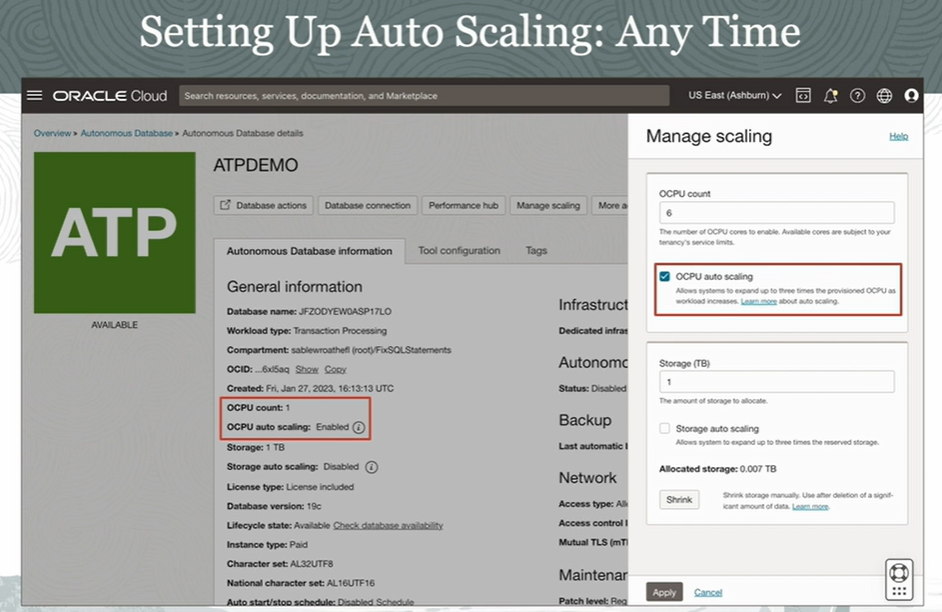

# Autonomous Database Auto Scaling

Autonomous Database allows you to scale up and scale down both OCPUs or CPUs, as well as storage and allows you to do this independently of the other.

You can also set up **auto scaling**. So the database, whenever it detects the need, will automatically scale up to **three times** the base level number of OCPUs that you have allocated or provisioned for the Autonomous Database. Changing the setting does not require downtime. So this can also be set dynamically. 

Auto scaling is not available for an always free database, but it is enabled by default for other tiered environments.

For an Autonomous Database **shared** service the OCPU limit is 128. You can go beyond that, but you would need to contact your Oracle Support channels to get that threshold raised. 

