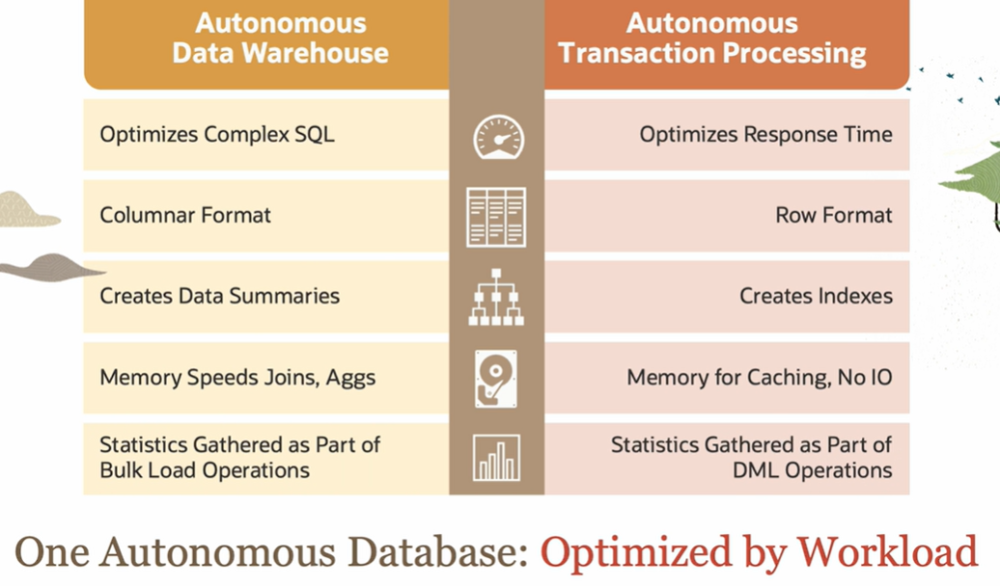

# Autonomous Database Introduction

**Autonomous Database (ADB)** eliminates the complexity of operating and securing Oracle database while giving customers the highest levels of performance, scalability, and availability.

ADB is based on the world's most secure, available, performant, and reliable database: **Exadata**.

Administering a mission-critical database is traditionally very expensive because it requires manual: provisioning, securing, monitoring, patching, backing up, upgrading, recovering, troubleshooting, testing, and tuning of a complex, highly available, scale-out deployment with disaster recovery protection. The extensive automation provided by the Autonomous Database dramatically simplifies these tasks, **reducing administration costs by up to 80%**.

Downtime for critical applications causes severe financial and reputational damage.

Flexibility is built into ADB on purpose to ensure the smoothest and easiest transition. There are two deployment choices:
1. shared exadata infrastructure (simple and elastic database)
2. dedicated exadata infrastructure (private database cloud)

A big concern, depending on the nature of the data, is sharing the cloud with other customers. It's not an issue for ADB. Autonomous Database runs in both Oracle Public Cloud and Cloud@Customer environments to address these concerns. 

Oracle Autonomous Database provides a level of performance and reliability that manually managed databases can't deliver. 

## Key Features

1. **Provision**: Exadata Cloud Infrastructure, RAC scale-out database, Active Data Guard
2. **Secure**: Applies security updated online, prevents admin *snooping* with DB Vault, encrypts all data
3. **Manage**: patches all software online, tunes settings, performs all OS and SYSDBA operations diagnose errors
4. **Protect**: automates backup restore, application transparent failover within a cluster or to a remote standby
5. **Scale**: instant, automatic online scaling of compute and storage (true pay-per-use)
6. **Optimize**: automatically optimizes data formats, indexes, parallelism and plan for each workload

## Optimized by Workload

Oracle Autonomous Database Warehouse is the simplest and most efficient database for datamarts, reporting databases, and data warehousing. 

Oracle Autonomous Transaction Processing is designed to run all enterprise applications from simple web apps, to mission-critical enterprise applications, including mixed workloads and real time analytics with no compromise on app performance.

