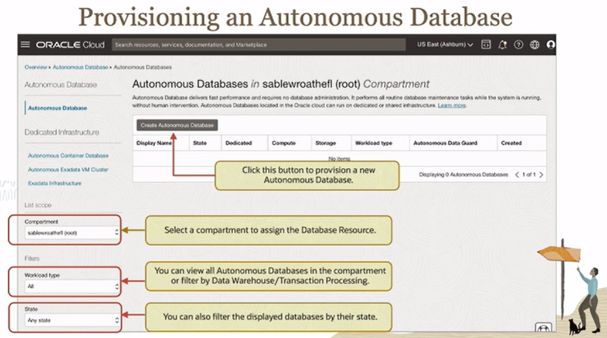

# Autonomous Database Provisioning

Oracle Cloud automates the process of provisioning an Autonomous Database, and it automatically provisions for you a highly scalable, highly secure, and a highly available database very simply out of the box.

When provisioning a database, the number of CPUs in increments of 1 for serverless, storage in increments of 1 terabyte, and backup are automatically provisioned and enabled in the database.

In the background, an Oracle 19c pluggable database is being added to the container database that manages all the user's Autonomous Databases. Because this Autonomous Database runs on Exadata systems, Real Application Clusters is also provisioned in the background to support on-demand CPU scalability of the service.

## Steps to provision an ADB

Provisioning an Autonomous Database is extremely fast, and it's very easy. There is no need to specify any tablespaces, to specify any system requirements, or operating system requirements, or initialization parameters.

1. Select the **Compartment**
2. Select the **Display Name**
3. Select the **Database Name** (provided by *default*)
4. Select the **Workload Type** (e.g. Transactional, Datawarehous, etc.)
5. Select the **Deployment Type** (shared vs dedicated)
6. Select the **Database Version** (e.g. 19c)
7. Select the **Number of OCPU** and **ocpu auto-scaling option**
8. Select the **Storage Size (TB)** and **storage auto-scaling option**
9. Select the **Admin Credentials** (i.e. password)
10. Select the **Network Access Type** (e.g. everywhere, VCN only, etc.)
11. Select the **License Type** (e.g. BYOL vs included)

