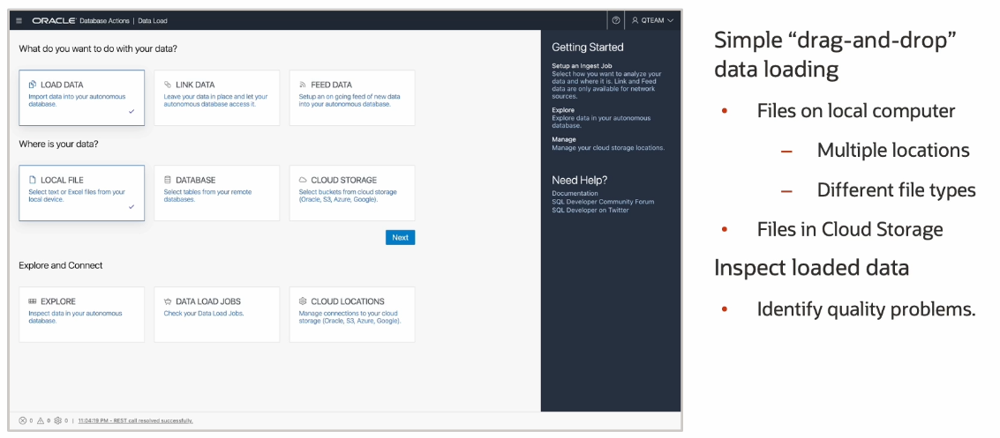

# Autonomous Database Tools

Autonomous Database comes with a sophisticated suite of tools pre-installed. There's nothing more to buy. There's nothing more to install. It's all right there at your fingertips in the OCI Console for Autonomous Database.

**Oracle Data Integrator (ODI)** is an enterprise class data integration tool with Extract, Load, and Transform (ELT) architecture. 

**Enterprise Data Quality (EDQ)** is a sophisticated powerful tool for profiling, cleaning, and preparing your data. 

**Analytic Views** built into the Oracle database provide a common framework for defining universally accessible **Semantic Models**.

**Oracle Analytic Cloud (OAC)** is a perfect complement, providing beautiful and insightful analysis of this data. 

## Database Actions - Data Tools

1. **Data Load**

2. **Data Transform**

3. **Business Models**

4. **Data Insights**

5. **Catalog**

