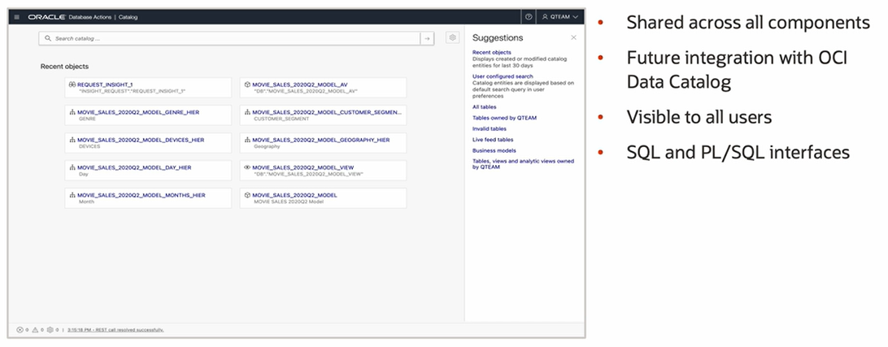

# Autonomous Database Tools

Autonomous Database comes with a sophisticated suite of tools pre-installed. There's nothing more to buy. There's nothing more to install. It's all right there at your fingertips in the OCI Console for Autonomous Database.

**Oracle Data Integrator (ODI)** is an enterprise class data integration tool with Extract, Load, and Transform (ELT) architecture. 

**Enterprise Data Quality (EDQ)** is a sophisticated powerful tool for profiling, cleaning, and preparing your data. 

**Analytic Views** built into the Oracle database provide a common framework for defining universally accessible **Semantic Models**.

**Oracle Analytics Cloud (OAC)** is a perfect complement, providing beautiful and insightful analysis of this data. 

## Database Actions

## Data Tools

1. **Data Load**

2. **Data Transform**

3. **Business Models**

Data analysts typically don't work directly against tables in the database. It's rare for the semantics of the data model to be apparent with the physical data structure itself. Instead, data analysts work against a semantic model. This is a layer above the physical data structure that defines its business significance.

A common problem with this is that different analysts, each with their own different self-service tool, can easily define different and contradictory business models, even on the very same data set. 

Oracle's approach is to push the business model into the database layer. There it only needs to be defined once, which in itself is a great productivity boost. But most importantly, this promotes consistency. By sharing this common business model, all analysts get a consistent view of the business. 

By automatically recognizing the hierarchy and defining it in the database, Autonomous Database can automatically compute and store these top-level aggregates. We call this **materialization of aggregate caches**. Now, because Autonomous Database knows about the hierarchy and knows about the existence of aggregate cache, it can transparently rewrite queries to access the pre-computed aggregates, rather than having to compute them on the fly. The result is exceptional performance, even with huge data sets, even with all the federated data sources. It all happens behind the scenes transparently. All the end user does is browse and access the data, just as if it were stored locally in the ADB and just as if it were stored at the lowest grain. 

**NOTE**. A business model is implemented as an **analytic view** in the database.

4. **Data Insights**

The tool identifies anomalies, which are deviations from expected values, using machine learning algorithms such as regression slope and catalogs them for the business user or analytics tool. This is a great feature for new users of ADB. Imagine creating a new data mart and then getting interesting results right away automatically.

5. **Catalog**

Use the catalog to view objects in Autonomous Database. There's a browser-like search capability and we can use the filter to show us entities of particular types. For individual entities, we can see valuable information, such as lineage of impact analysis at various levels of detail.

