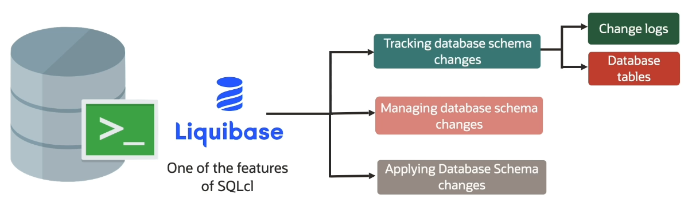

# APEX

Gartner says that:

    "By 2024 low-code application development will be responsible for more than 65% of application development activity".

Forrester says that:

    "10 times faster than traditional methods."

Why use Low Code ?
- build apps faster
- deliver great quality and consistency
- reduce development costs
- focus on business requirements
- less technical debt

What APEX does for you ?
- user interface
- data access
- visualization
- security
- globalization
- performance

## CI/CD for APEX

CI/CD stands for Continuous Integration and Continuous Delivery/Deployment. 

It is **automation** into the various stages of the development life cycle. It introduces **consistency** into your development process.

The development in the APEX flow is a lot different than the traditional one we see with that. And it's mainly because it's a **stateful versus stateless** process. It's not always easy to version in APEX. And it's not always easy to version in the database rolling back. 

## SQLcl and Liquibase

SQLcl is basically a command line SQL Plus tool that's about 35 megs bit, which you can connect to pretty much any database you have without having to download the entire Oracle client. It's great because we have all these great features built into it.

SQLcl has a bunch of features in it and one of the features is **Liquibase**. Liquibase comes free with SQLcl (no extra pay).

Liquibase is going to allow you to have this change tracking for database schema changes as well as your Application Express apps in there. The Liquibase feature enables you to execute all these commands that allow you to do this change tracking and then move them from environment to environment in a manual or automated way.

**NOTE**. You can actually pull data out with Liquibase but what this is great for is **metadata tables**.

## Terraform

Terraform is a tool for building, changing, and versioning infrastructure safely and efficiently.