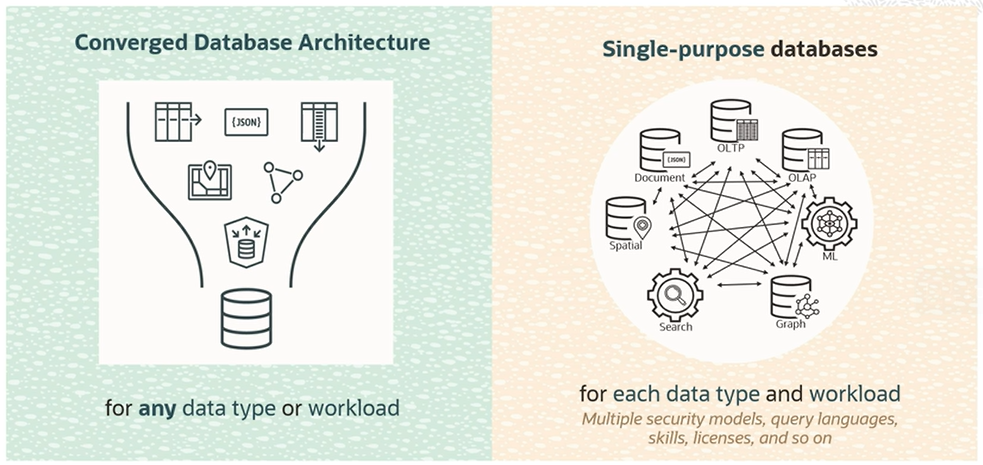

# Converged Database

Application Development has become more and more complex. Developers face a whole new set of requirements for enterprise apps. Apps not only had to capture information on what customers were doing, but they had to also anticipate customers' needs, and allow the business to create value or insights from data in real time.

These modern or data-driven apps operate on a diverse set of data (spatial, documents, sensor, transactional, etc.) pulled from multiple sources, often in real-time, and they create value from that data in very different ways compared to traditional applications. 

Data-driven apps are often built using new data-driven development methodologies or paradigms to help accelerate the development process. These apps also need to be developed and enhanced using continuous delivery as they're often 24/7 applications. They can't afford to take any downtime for patching.

## Single Purpose Database App Dev Approach

Advantages:
- developers are able to quickly begin a new project
- it offers a convenient model that fits the project's purpose
- it is easy to adopt APIs that seem natural for that data model

Disadvantages:
- even the simplest of projects require multiple data types and workloads
- complexity and fragmenting the data across multiple single-purpose databases
- each database will require app developers to use their proprietary APIs or languages and transactional models
- apps getting locked-in in to a single-purpose database or cloud provider
- more complex application code to be written, and maintained to propagate data from one store to another, and to keep them in sync
- each single-purpose database requires ongoing tuning, securing, scaling, troubleshooting, patching, requiring specialized skills and unique management tools

## Oracle Converged Database App Dev Approach

Oracle makes it simple to build data-driven apps by providing **Synergistic Data Technologies**.

**One Converged Database** for all data types and models engineered to work together. 

Advantages:
- it eliminates the data fragmentation introduced by multiple single-purpose databases
- it offers support for all data types and data models in **a single converged database**
- it makes easy for developers to take advantage of any data type or data model by providing a **uniform API** in the form of **SQL** and **REST** for all data types and workloads 

**THIS NOT MEANS** to go back to use a monolithic database for all of your database applications. A converged database still allows each application service to be modularized or containerized with its own independent data store or database container. This means the data types or workloads you are working with won't dictate your architecture.

Oracle simplifies microservice architecture by allowing each service to store its data in logically separate data containers called **pluggable database or PDB**, providing all of the isolation and independence needed in a microservices architecture. Just as you would deploy your applications or services using Kubernetes containers, you can deploy the database for those services as pluggable database, making microservices simple. 

## Converged Database Architecture

The general strategy at Oracle is to build a **single-converged database architecture** that can handle multiple types of data and different types of workloads over that data. It can store relational, JSON, XML, graph, and spatial data.

And then you can build both interactive transactional applications or analytic and reporting applications over that data. And we aren't saying here that we think all your data should actually go in one database. But there are both technical and practical advantages to have all your data under one database architecture.

Avoid inefficiencies associated with moving data between systems, one query language, one set of skills required to use the database, one security model. 

