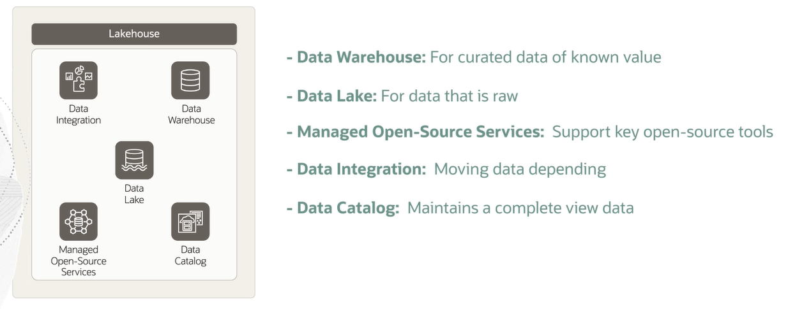
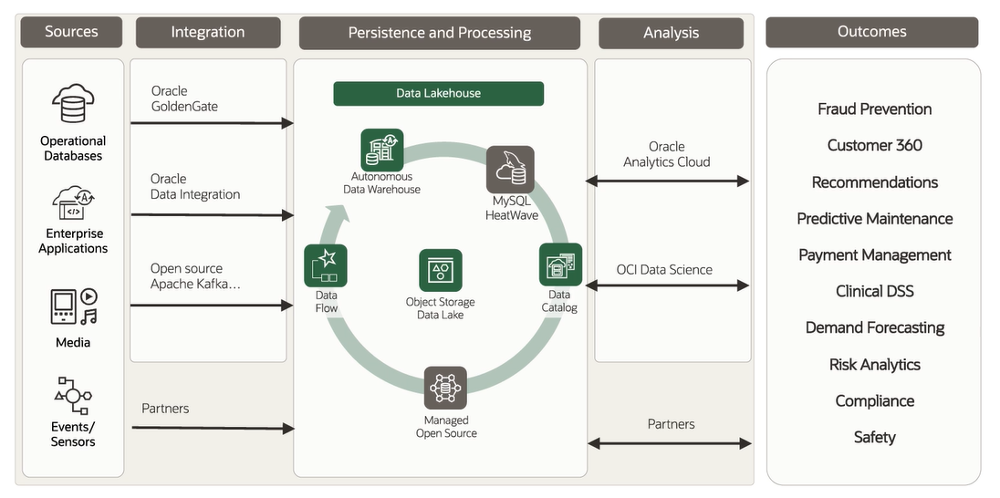

# Data Lakehouse

When deciding how to best increase their data productivity and liquidity, companies often find themselves having to make a choice between leveraging a **data lake** or a **data warehouse**, each of them having their own benefits and drawbacks.

**Data Lakehouse** combines current data warehouse and data lake components with capabilities to also include external or third party data. This effectively eliminates data silos or having to manually move data between data warehouses and data lakes if you leverage both currently.

The five key elements of the Oracle Lakehouse are:
1. **data warehouse**: for curated data of know value
2. **data lake**: for data that is raw (loading and staging data)
3. **managed open-source services**: support key open-source tools (Spark, Hadoop, Redis)
4. **data integration**: moving data depending on use case
5. **data catalog**: complete view of the available data for discovery and governance

## From Sources to Outcomes

We have functions that move data from sources to outcomes. The process is taking the source, going through integrations, and connecting to different data. Once we've done this, traditionally, we looked at persistence, processing the data and storing it somewhere to pass along for analysis. This has connected and curated the data for outcomes. 

## Data Catalog

Data Catalog is the source of truth for Object Store metadata:
- harvest object storage to derive schemas
- manage business glossary, terms, and tags
- discover data using powerfule search