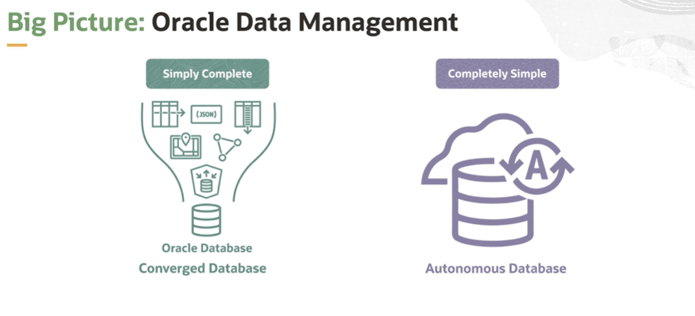
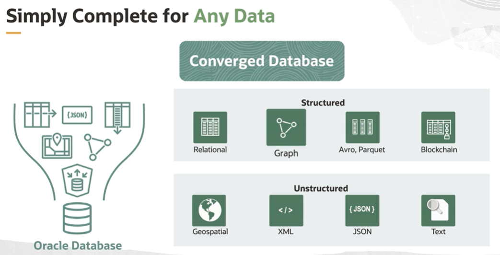
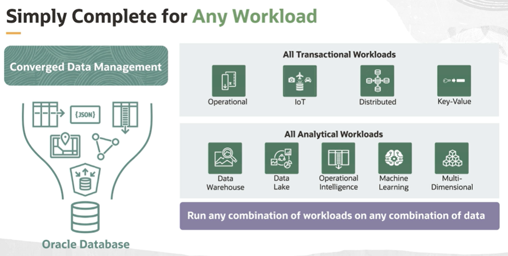
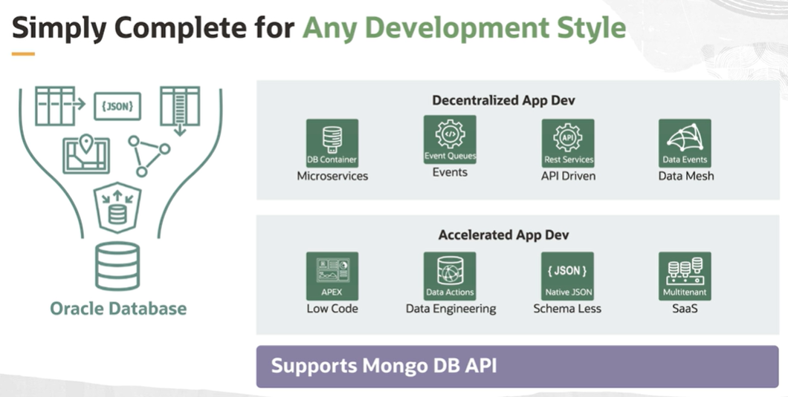
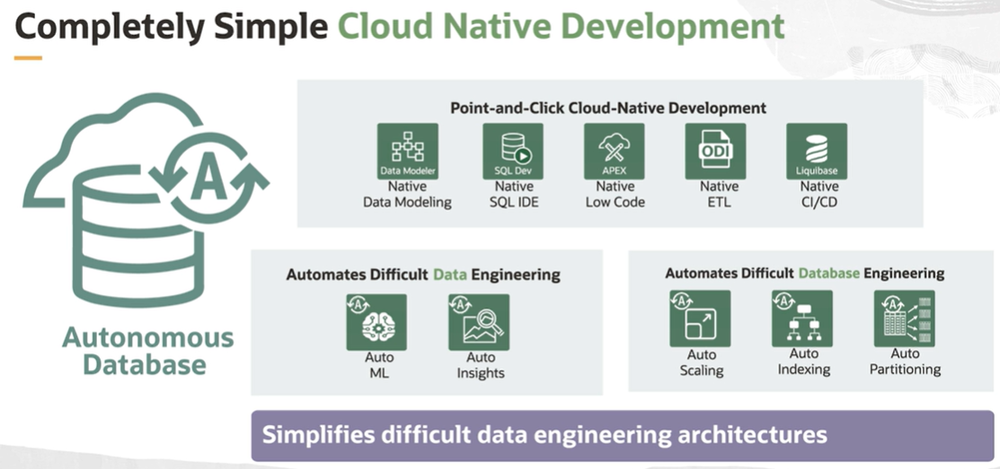
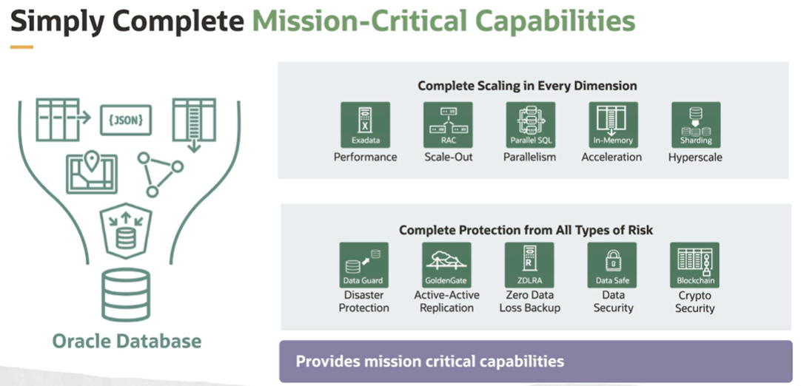
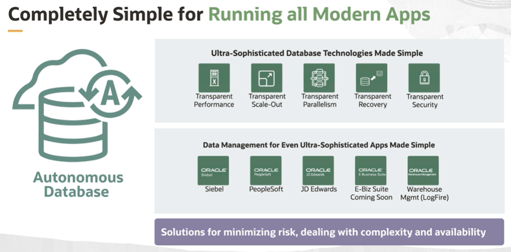

# Data Management Strategy

Oracle's big picture data management strategy is simply complete and completely simple with the converged database, data management tools, and the best platform.

It is focused on providing a platform that allows for modern app development across all data types, workloads, and development styles. It is completely scalable, available, and secure, leveraging the database technologies developed over several years. And it's available consistently across the environment. It is the simplest to use because of the available tools and running completely mission critical applications.

## Any Data

Oracle Database is a **converged database** that provides best of breed support for all different data models and workloads that you need. 

When you have converged support for application development: 
- you eliminate data fragmentation
- you can perform unique queries and transactions 
- you can create value across all data types 

This also includes structured and unstructured data. 

## Any Workload

## Any Development Style

Oracle's decentralized database architecture makes decentralized apps simple to deploy and operate. 

Autonomous Database now supports the Mongo database API adding more tools for architectural support.

## Cloud Native Development

Autonomous Database (ADB) has a set of automated tools to manage, provision, tune, and patch. It provides solutions for difficult database engineering with auto indexing and partitioning and is elastic. You can automatically scale up or down based on the workload. Autonomous Database is also very productive. It allows for focus on the data for solving business problems. ADB has self-service tools for analytics, data access, and it simplifies these difficult data engineering architectures.

## Mission Critical Capabilities

Mission critical capabilities that are needed for the applications are already provided in the functionality of the Oracle Data Management architecture. Disaster recovery, replication, backups, and security are all part of the Oracle Autonomous Database.

## Running All Modern Apps

Even complex business critical applications are supported by the operational security and availability of Oracle Autonomous Database. Transparently, it provides automated solutions for minimizing risk, dealing with complexity, and availability for all applications. Oracle's big picture data management strategy is simply complete and completely simple with the converged database, data management tools, and the best platform.

