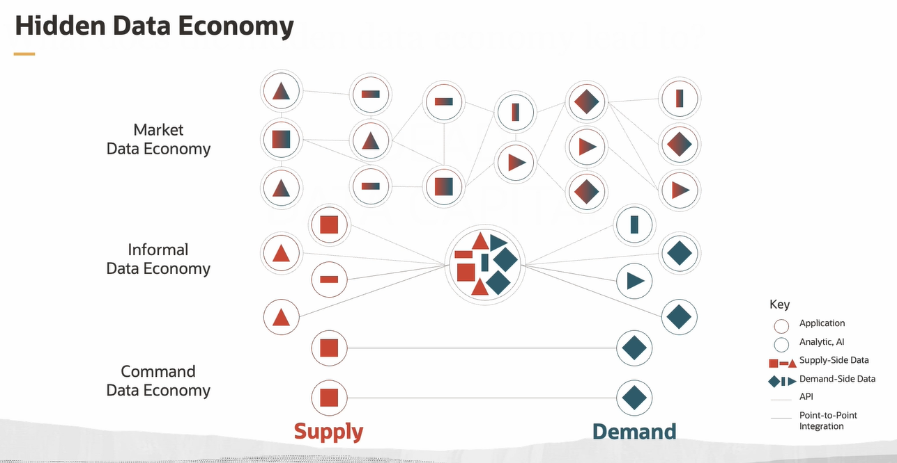
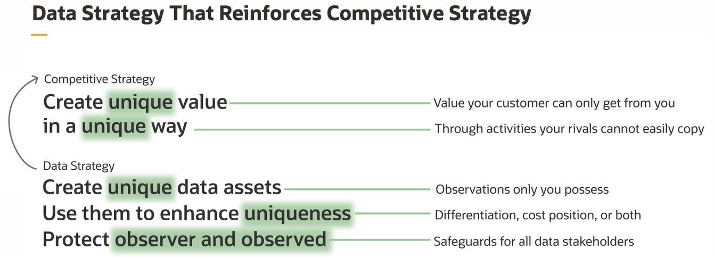
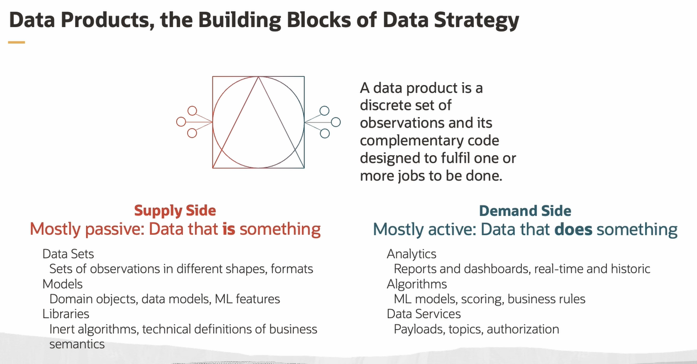
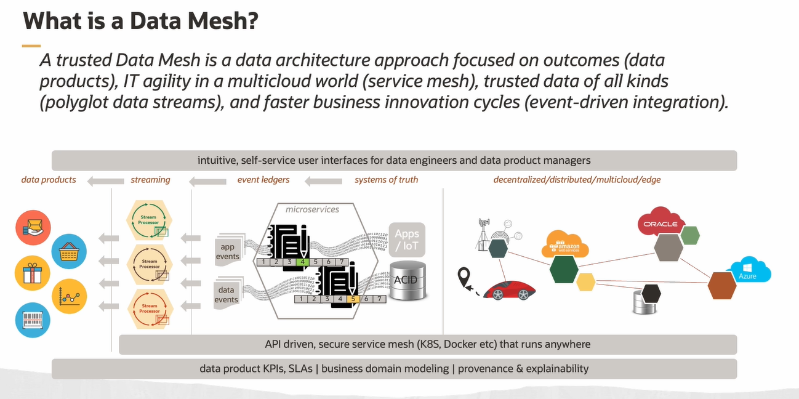
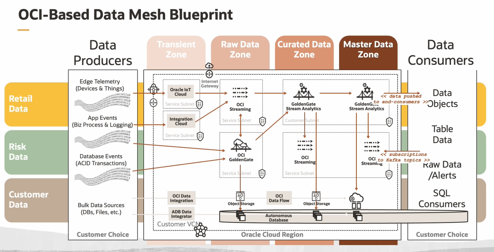

# Data Mesh Architecture

Data Mesh aims to improve business outcomes by driving more data-centric solutions. A mindset shift is the most important first step toward using Data Mesh.

**Design Thinking** methodologies bring proven techniques that help break down the organizational silos frequently blocking cross-functional innovation. 

The **Jobs to be Done Theory** is the critical foundation for designing data products that fulfill specific end customer goals or jobs to be done. It defines the product's purpose.

The **Data Product approach** initially emerged from the data science community but is now going mainstream being applied to all aspects of the data management discipline. It keeps the focus on the business outcomes, the data consumers, all rather than the IT and technology. Data product thinking can be applied to other data architectures, but it's an essential part of the Data Mesh.

## What is Dead Data Capital ?

Data assets that either go unused or fail to deliver their option value because they're trapped in data silos too difficult to repurpose or being undiscoverable or ineffectively governed such that they're allowed to be used in an unclear way. 

Obviously, this is unacceptable and the reason every company is bent on digital transformation.

Can you safely grow your data economy balancing both **data innovation** and **data compliance** ? The key is a **Data Strategy** that reinforces competitive strategy.

## Data Products

Data products are the building blocks of data strategy. It is a set of observations, and its complementary code designed to fulfill one or more jobs to be done. 

The supply side are the:
- Data Sets
- Models
- Libraries. 

The demand side is the need for:
- Analytics
- Algorithms for ML
- Data Services

## Data Strategy

There are four principles for translating data strategy into data architecture:
1. Data Liquidity
2. Data Productivity
3. Data Security
4. Data Governance

## Data Mesh

A proper Data Mesh is a **mindset**.

A Data Mesh is an **organizational model** and an **enterprise data architecture** approach. 

A Data Mesh should have some **mix of**:
- data product thinking
- decentralized data architecture
- event-driven actions
- streaming-centric service mesh style of microservices design

A Data Mesh is **NOT**:
- a single cloud data lake
- a point product (no vendor has a singular product for Data Mesh)
- an IT consulting project
- data fabric
- self-service analytics

Trusted Data mesh attributes:
1. Value-Focused, Data Product Thinking
2. Decentralized, Multicloud Mesh
3. Enterprise Data Ledgers
4. Trusted, Polyglot Streams

