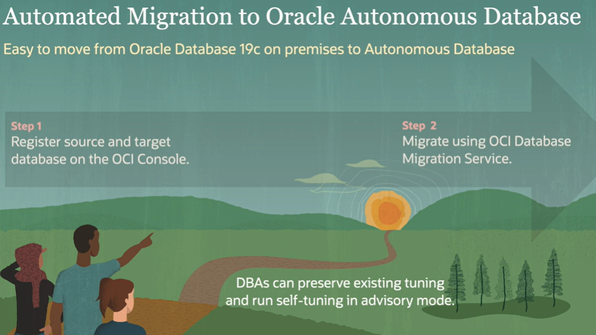

# Oracle Database Offering

 Autonomous Database (ADB) is a fully managed service. Oracle fully manage the infrastructure and the database.

 

Wikibon Research found the cost for ATP is almost half of what you could do On-Premises.

 

## Manual Migration to Oracle Autonomos Database

1. Run the Cloud Premigration Advisor Tool (CPAT)
2. Export on-premises database using Data Pump
3. Transfer exported dump files to Object Storage
4. Import into ADB using Data Pump

If you've already tuned this application on-premises for years, there's no need to use the autotuning capabilities of ADB.

 

 ## Automated Migration to Oracle Autonomous Database

## Easing the Path to Oracle Autonomous Database

