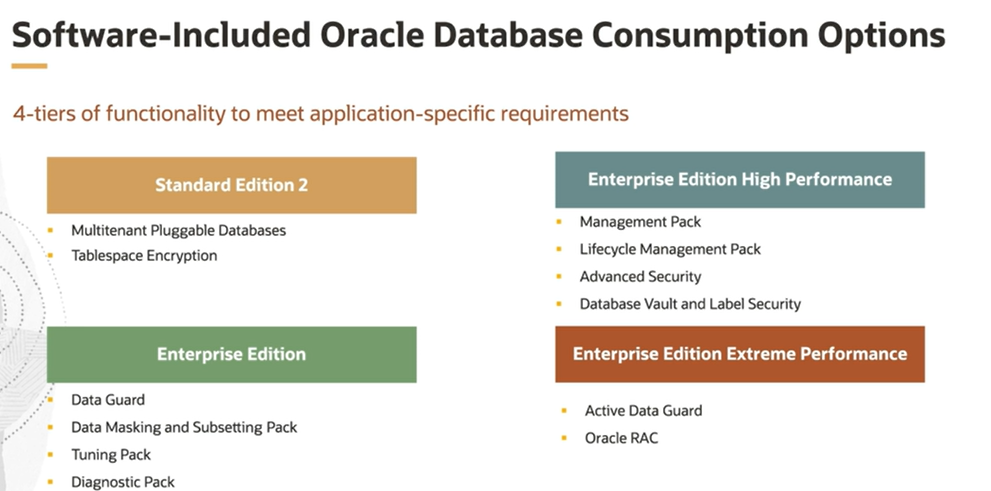
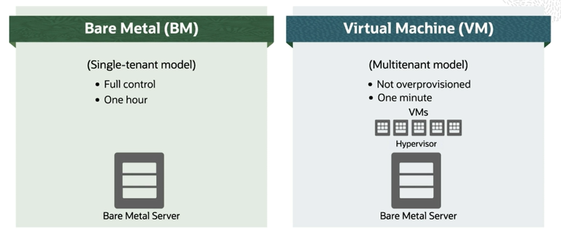

# DBCS Offering

Oracle Database Cloud Service (DBCS) provides you the ability to deploy Oracle Databases to the cloud. You can deploy Enterprise Edition or Standard Edition 2 and any database version from 11.2 and later.

You have the option to deploy using virtual machine or bare-metal shapes. Database Cloud Service VM and BM metal DB systems are deployed in Oracle Cloud Infrastructure regions around the world. 

With Database Cloud Service, you manage the database instance, including provisioning, patching, backup, and disaster recovery using OCI Cloud automation tools, such as the OCI console, CLI, and API. There is also an SDK that supports a number of different languages. Using VM shapes, you can deploy real application clusters and scale your storage requirements.

## Consumption Options

Beginning with Standard Edition 2, features included with the service are Multitenant Pluggable Database and Tablespace Encryption. 

Moving to Enterprise Edition, you add additional database features, such as Data Guard and the EM packs of Data Masking and Subsetting, Tuning, and Diagnostics.

With Enterprise Edition High Performance, in addition to the base Enterprise Edition, you add Management and Lifecycle Management packs as well as Advanced Security and Database Vault and Label Security. 

And finally, Enterprise Edition Extreme Performance has all the previously discussed features, plus Active Data Guard, Oracle RAC, and Database In-Memory. 

All packages include Oracle Database Transparent Data Encryption, TDE. 

You have an option to bring your own license, BYOL, which means you can use your organization's existing Oracle Database software licenses. 

## Bare Metal vs VMs

Bare-metal instances are single tenant and you have full control over the resources provisioned within the service.

Virtual machines follow a multitenant model and share servers that are not overprovisioned.

For databases using bare metal and virtual machine infrastructure Oracle Cloud Infrastructure uses per-second billing. This means that OCPU and storage usage is billed by the second with a minimum usage period of minute for virtual machine DB systems and one hour for bare metal DB systems.

## Bare Metal

Database Cloud Service on bare metal is a Database Service offering that enables customers to deploy and manage full-featured Oracle Databases on bare-metal servers. Bare metal offers proven and predictable performance with local NVMe storage on dedicated servers that provide high IOPS with extremely low latency. 

Bare-metal DB systems consist of a single bare-metal server running Oracle Linux with locally attached NVMe storage. If the node fails, you can simply launch another system and restore the databases from current backups. Bare-metal DB system provide dedicated resources that are ideal for databases that are performance intensive.

When you launch a bare-metal DB system, you select the single Oracle Database edition that applies to all the databases on that DB system. The selected edition cannot be changed. Each DB system can have multiple database homes which can be different versions. Each database home can have multiple databases, which are, of course, the same version as the database home. 

ASM directly interfaces with the disks. When you provision a bare-metal system, you will indicate the data storage percentage assigned to data storage, which is user data and database files. Your choice is 40% or 80%. The remaining percentage is assigned to RECO storage consisting of database redo logs, archive logs, and recovery manager backups.

Storage is continuously monitored for any faults. Any disk that fails will be taken offline. Whenever the shapes list a maximum amount of usable space and data in RECO, these reservations for rebalancing are already taken into account. The root user has complete control over the storage subsystem. So customization and tuning are possible. But the service already optimally configures these by default according to best practices. 

## Virtual Machines

Database Service on VMs is a Database Service offering that enables customers to build, scale, and manage full-featured Oracle databases on virtual machines. The key benefits of running databases on VMs are cost-effectiveness, ease of getting started, durable and scalable storage, and the ability to run real application clusters, RAC, to improve availability. 

Database Cloud Service on VMs is built on the same high performance, highly available Cloud Infrastructure used by all Oracle Cloud Infrastructure services. RAC databases will run on a single availability domain, AD, while ensuring each node is on a separate physical RAC, ensuring high availability.

When you launch a virtual machine DB system, you select the Oracle Database edition and version that applies to the database on that DB system. The selected edition cannot be changed. Depending on your selected Oracle database edition and version, your DB system can support multiple pluggable databases, PDBs. 

A virtual machine DB system database uses Oracle Cloud Infrastructure block storage instead of local storage. You specify a storage size when you launch the DB system. And you can scale up the storage as needed at any time.

For one-node virtual machine DBs systems, Oracle Cloud Infrastructure provides a fast provisioning option that allows you to create a DB system, using Logical Volume Manager, LVM, as your storage management software. Fast provisioning for an Oracle Database with Logical Volume Manager increases developer productivity.

You also have a choice to select ASM storage management. You will select Oracle Grid Infrastructure when you provision your DB system to use Oracle Automatic Storage Management. This is required for RAC deployments. Virtual machine DB system deployments with ASM support 11.2 database versions and above, whereas virtual machine DB system deployments with LVM support 12.2 database versions and above. 