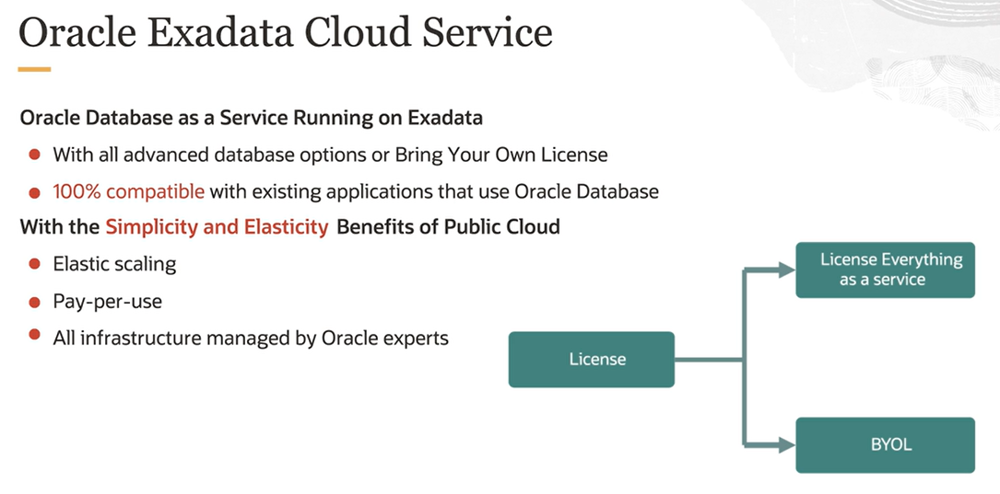
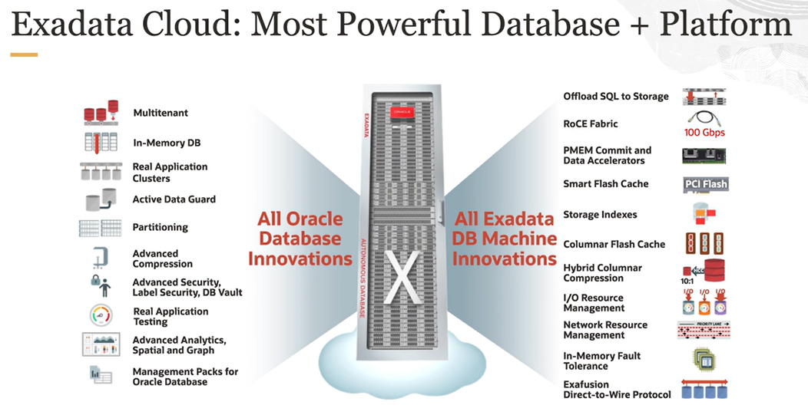
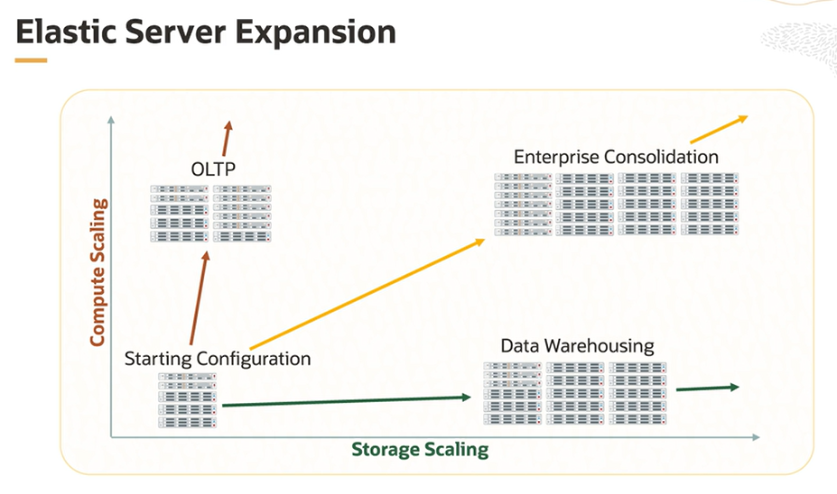
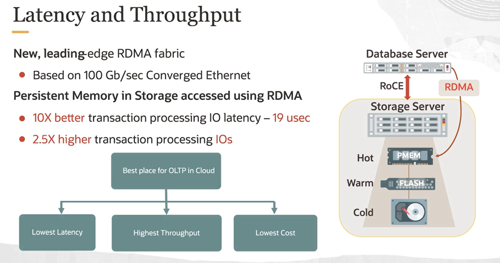
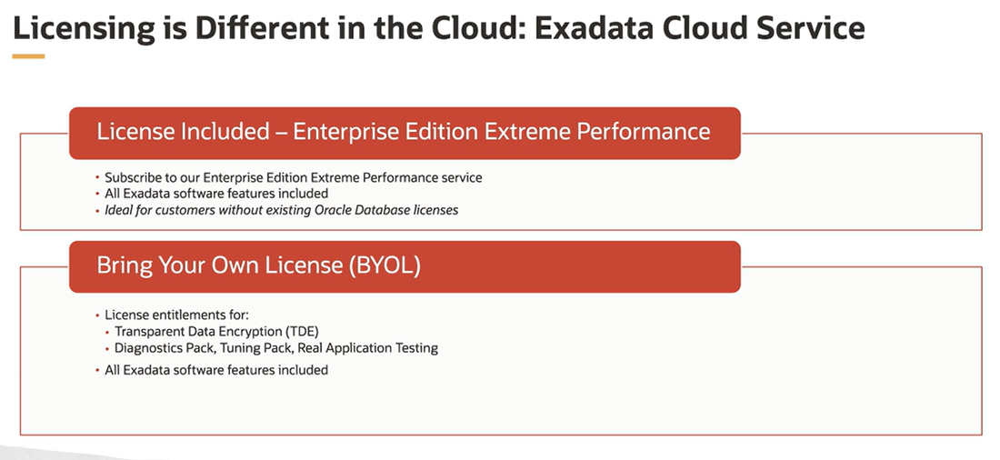

# Exadata Deployment Options

Exadata Cloud Service X8M  is the latest release of Oracle's Premier Database Cloud Service.

Exadata is the best platform for running the Oracle Database:
- Ideal Database Hardware
- Database Aware System Software
- Automated Management
- Identical on-premises and in the cloud

## Exadata Cloud Service

Exadata Cloud Service is the Oracle Database running as a service on an Exadata in Oracle Cloud infrastructure. It includes all the advanced database features and options available for the Oracle Database. You can license everything as a service or bring your on-premise licenses to the cloud.

Since it runs the same Oracle Database you run on premise, it is 100% compatible with any existing applications. For all practical purposes, it looks exactly like an Oracle Database running on an Exadata on premise. The big difference is the public cloud features and benefits, specifically the **simplicity and elasticity**. 

## Exadata Cloud Service Shapes

Customers can choose:

- an entry-level base system (which is not expandable)
- or subscribe to the Exadata Cloud Service X8M

The X8M shapes start with a quarter rack and allow elastic expansion by adding additional database and storage servers to enable higher compute and storage capacity. The X8M shape benefits from the performance improvements associated with persistent memory (PMEM) or RoCE.

Exadata Cloud Service X8M allows fully elastic expansion. You start out with a small minimum size configuration, with two compute servers and three storage servers that provide full high availability against compute, storage, and networking component failure, and allows you to use up to 100 OCPUs and roughly 150 terabytes of storage. These systems are **dedicated to you**. They aren't shared with other users. Then you can add storage and compute servers as needed. 

Key Features of X8M shapes
- State-of-the-Art hardware improvement
    - the **persistent memory (PMEM)**
    - the secure network fabric based on **RDMA (Remote Direct Memory Access) over converged ethernet (RoCE)**
- Elastic Configuration
    - configure what you need (database/storage servers)
    - pay only what you use
- Switch from XEN to **KVM virtualization** (the same technology of the rest of OCI)

## Exadata Cloud Service Features

1. Single-click Oracle **Real Application Cluster (RAC)**
2. **RDMA** to accelerate OLTP messaging
3. **Smart Scan** which offloads basic operations, like SQL queries, analytics processing, and machine learning algorithms, from database server cores to the CPU cores and intelligence storage servers. This has three major effects: it accelerates runtimes, it frees up database server cores, it reduces costs.
4. **Fully Active Remote Database** copies that are typically created for disaster recovery purposes, but can also be used for a secondary processing, like reporting, QA, or development and testing.

## Remote Direct Memory Access (RDMA)

RDMA allows the database CPU cores to read data from and write data directly into the memory of intelligence storage servers **without involving the operating system or networking stack overhead**. This combines with the extremely low latency of persistent memory located in intelligence storage servers to lower both SQL read and write latencies, which are two of the most critical factors impacting OLTP performance on a database system. 

## Management Interface

Exadata Cloud service provides a wide choice of management interfaces:
- Web Browser Interface 
- Oracle Cloud REST APIs 
- Software Development Kit (SDK)
- Terraform Interface

## Licensing Model

You can switch between the two models at any time, as often as you like. This means, for example, that you could use BYOL most of the time and switch over to the licensed service to handle infrequent spikes on workload that require more capacity than you have licensed via BYOL.

