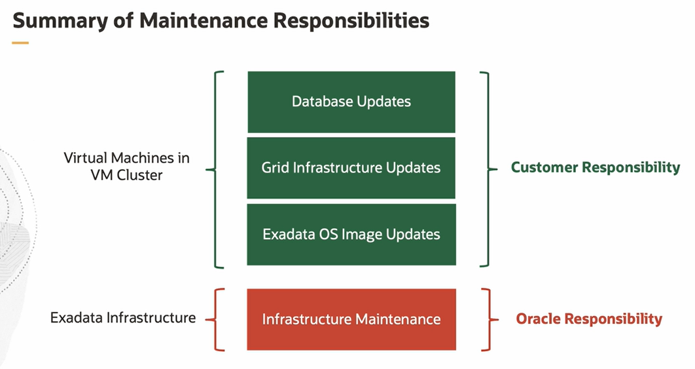

# Exadata Lifecycle Management

A single Container Database (CDB) with a single Pluggable Database (PDB) is created by default when a DB system is created. Virtual machine DB systems only support a single database. 

To create a database, you must create a new DB system. You can also create a database from backup. The Oracle database software version you specify must be the same or a later version as that of the backed up database.

You can also move an existing database to a new database home. This is particularly useful and the easiest way to patch a database.

You can use Oracle Cloud Infrastructure Vault to centrally manage encryption keys.

# Default Automatic Backup Configuration Settings 

Automatic backups are scheduled daily. 

Archive the Redo Log files are backed up every 30 minutes. 

Backups follow a seven-day cycle, consisting of one full backup of the database, followed by daily incremental backups. 

The retention period defines the period for which backups are maintained. Backups to cloud storage are maintained based on the retention choice of 7, 15, 30, 45, or 60 days. 
The backup data is automatically encrypted using Oracle Transparent Data Encryption. 

## Maintenance Responsibilities

Oracle is responsible for infrastructure maintenance. This includes the physical database and storage servers, VM hosts, as well as the network fabric. Exadata Cloud Service infrastructure updates are released on a quarterly basis and customers can schedule infrastructure maintenance with Oracle. Updating the Exadata OS image, Grid Infrastructure, and databases is the customer's responsibility. Oracle provides cloud user controlled cloud automation to perform these updates.

