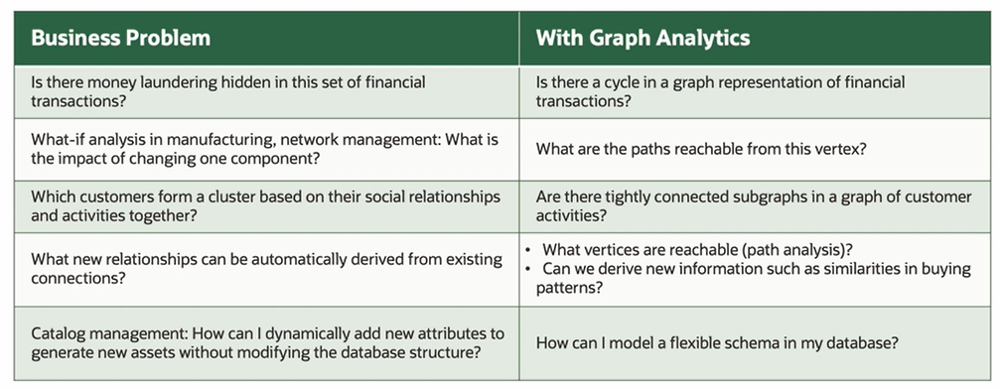
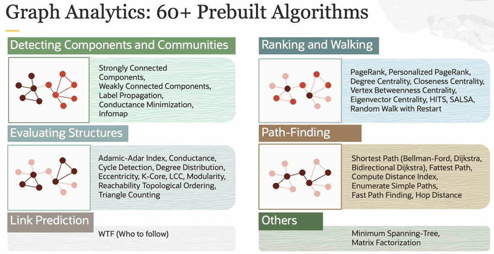

# Graph Database

Properties of a **Graph Data Model**:
- collections of points (vertices) and lines between those points (edge)
- vertices and edge can have properties

What can you do with graphs ?
- detect anomalous pattern
    - uncover fraud
    - money laundering
- clustering to detect communities
    - analyze churn
    - product recommendations

## Graph Analytics

## Oracle Graph

It is **free** and **included** in all Oracle database editions.

Oracle Graph consists of:
- a means to model and store your graph data
- a means to query it
- a means to analyze it
- a means to visualize and interact with query or analysis results

The query language is called **Property Graph Query Language (PGQL)**. It's like SQL, but extends it to enable you to specify graph patterns, such as cycles, which are then evaluated against the graph.

There are over **60 built-in graph algorithms** to perform graph analytics, such as finding paths, detecting communities and influencers, or ranking vertices by importance.

## Graph Analytics

Graph analytics are operations on all or parts of the graph. Some are iterative, some are recursive, but most are computationally expensive. Oracle Graph has over 60 built-in operations implemented as efficient parallel in-memory algorithms. Algorithms for detecting communities or evaluating structures or ranking vertices may operate on the complete graph, while path finding, such as finding the shortest route between a start and end node, usually operates on portions of a graph. 

