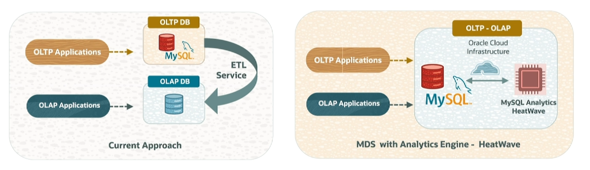
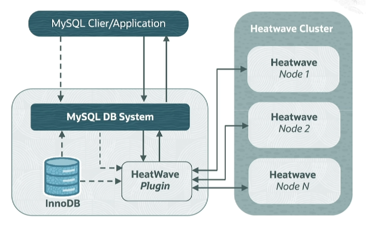
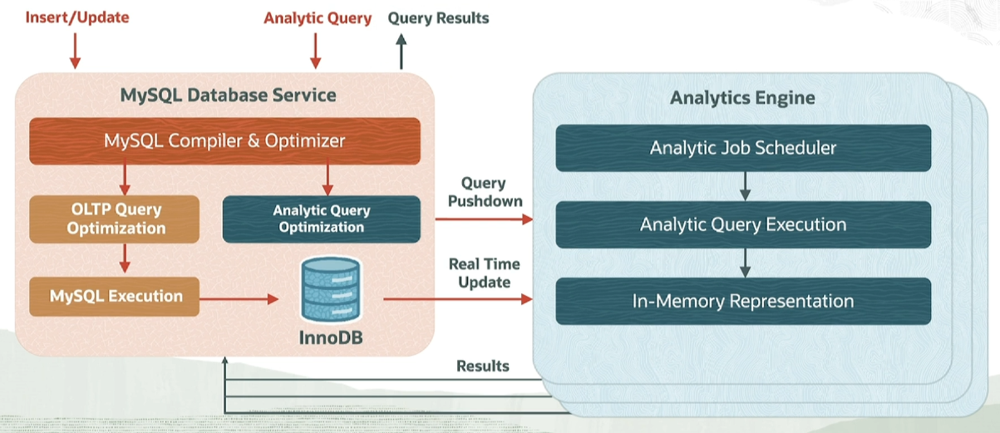

# MySQL HeatWave

Many organizations choose MySQL to store their valuable enterprise data. MySQL is optimized for Online Transaction Processing, OLTP, but it is not designed for Online Analytic Processing, OLAP.

As a result, organizations that need to efficiently run analytics on data stored in MySQL database move their data to another database to run analytic applications, such as Amazon Redshift. 

MySQL HeatWave is designed to enable customers to run analytics on data that is stored in MySQL database without moving data to another database. 

## HeatWave Architecture

HeatWave is built on an innovative in-memory analytics engine that is architected for scalability and performance and is optimized for OCI. It is enabled when you add a HeatWave cluster to a MySQL database system. 

A **HeatWave cluster** comprises a MySQL DB system node and two or more HeatWave nodes. The MySQL DB system node includes a plugin that is responsible for cluster management, loading data into the HeatWave cluster, query scheduling, and returning query results to the MySQL database system.

The HeatWave nodes stored data and memory and process analytics queries. Each HeatWave node contains an instance of the HeatWave. The number of HeatWave nodes required depends on the size of your data and the amount of compression that is achieved when loading the data into the HeatWave cluster. Various aspects of HeatWave use machine learning-driven automation. That helps to reduce database administrative costs. 

## Loading Data and Running Queries

When loading a table into the HeatWave cluster, data is read from InnoDB using batched multithreaded reads. Data is then converted into the columnar format and sent over the network and distributed among the HeatWave nodes. Data is distributed among HeatWave nodes by slicing tables horizontally.

Users and applications interact with HeatWave through the MySQL database node in the cluster. Users connect to HeatWave through standard tools and standard-based ODBC and JDBC connectors. Once users submit a query to the MySQL database, the MySQL query optimizer transparently decides if the query should be offloaded to HeatWave cluster for accelerated execution. This is based on whether all operators and functions referenced in the query are supported by HeatWave and if the estimated time to process the query with HeatWave engine is less than with MySQL. If both conditions are met, the query is pushed to HeatWave nodes for processing. Once processed, the results are sent back to the MySQL database node and returned to users. Data of HeatWave is persisted in MySQL and ODB. 

Any updates to the tables are automatically propagated to the memory of the HeatWave nodes in real time. This allows subsequent queries to always have access to the latest data, as shown in the figure in this slide. This is done behind the scenes by a lightweight change propagation algorithm that can keep up with MySQL data update rates. 

## Remember

1. HeatWave is exclusively available in OCI and is an in-memory query processing engine. 
2. HeatWave using machine learning to automate operations, which increases DBA productivity. Innovative in a memory columnar analytics engine and optimization are two key architecture features. 
3. Stopping HeatWave cluster turns off cluster billing, and data must be reloaded after restart. 
4. Deleting the HeatWave cluster does not delete the DB system or any of the data. However, deleting the DB system also deletes the attached HeatWave cluster.