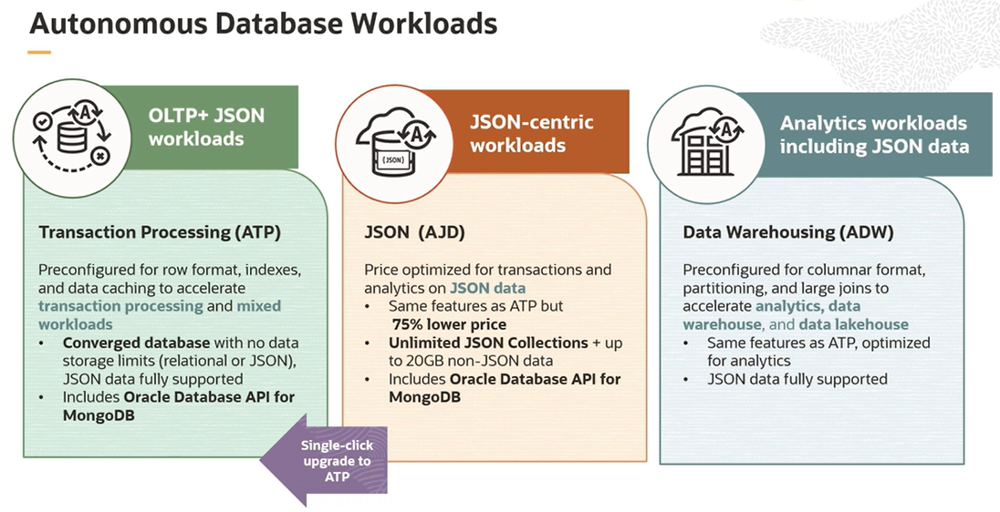
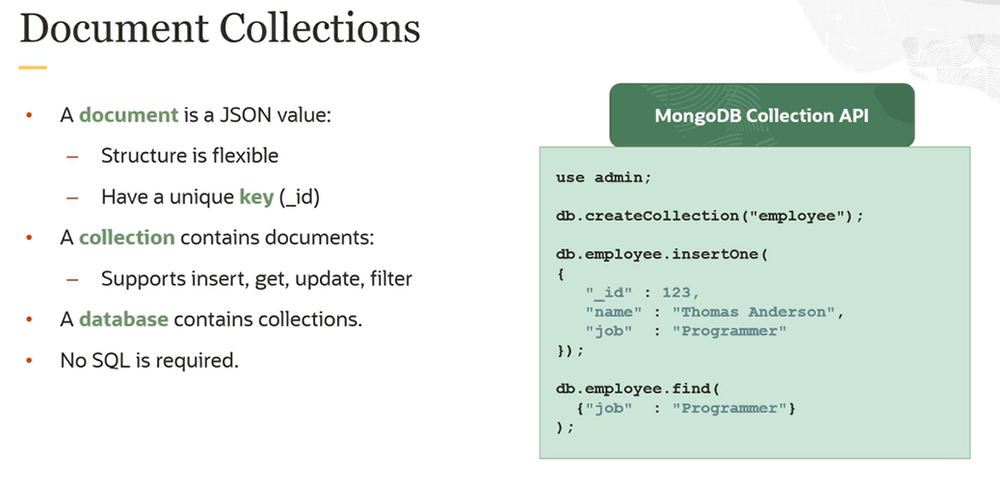

# JSON Database

JSON is a fairly simple way to describe or model your data. It has a small set of types: objects, arrays, strings, numbers, and booleans. 

The **Autonomous JSON Database (AJD)** is the version of the Autonomous Database intended for building interactive applications and microservices that primarily need to store JSON data. You can connect to it using either collection APIs or SQL. 

The AJD functionality is the same as ATP, the transaction processing database. The difference is that in AJD, you can **only store up to 20 gigabytes of non-JSON data**. That is, you're only allowed to scale up JSON data. However, because of this restriction, AJD has a lower price. AJD **can be upgraded to ATP** at any time, removing the JSON restriction. 

AJD is intended to compete with NoSQL document stores, mainly MongoDB, but also Couchbase, Azure Cosmos DB, and AWS DocumentDB. And it provides most of the same benefits typically associated with NoSQL stores. 

ADJ Features:
- elastic compute and storage
- single digit latency reads and writes
- high available
- low price, always free-tier

## Document Collections

Collections are similar to tables, except instead of containing rows, they contain documents. A document is a JSON value that is schema flexible. Unlike a row, a JSON document doesn't have a fixed set of attributes, and it can also contain nested structures. 

Each document in a collection is uniquely identified by a key. And typically with collections, you will use a simple programmatic API to access the data rather than SQL. The API supports operations like get, put, update, and find. 

The idea here is that the table backing the collection is still accessible using SQL when you need it. You get the best of the SQL and NoSQL worlds with AJD. If you're building a microservice or application where you simply want to persist your data, using SQL may make the application code a bit more verbose than it really needs to be. And for some developers, it may even be a barrier to entry.

The API allows you to very simply put, get, update the JSON objects in the database. It is actually creating a table with a JSON column in the background. This backing table is still accessible using SQL. And at a deep level in the database kernel, we have added extensions to SQL to allow it to process JSON data, so you can use SQL when it's needed. 

