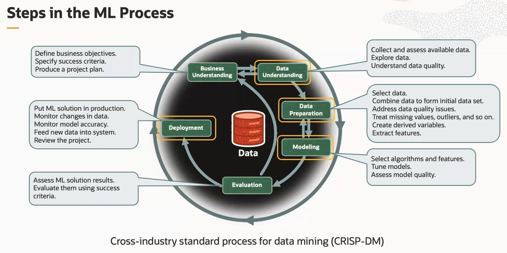

# Oracle Machine Learning (OML)

The Oracle Machine Learning (OML) tagline is *move the algorithms, not the data*. To realize this, Oracle placed powerful machine learning algorithms in the database kernel software, operating below the user security layer. OML eliminates data movement for database data and simplifies the solution architecture, as there is no need to manage and test workflows involving third-party engines.

OML extends the database to enable users to augment applications and dashboards with machine learning based intelligence quickly and easily. It delivers over 30 in-database algorithms accessible through multiple language interfaces. It's important to note that the broader Oracle ecosystem for data analytics and machine learning also includes tools like Oracle Analytics Server, and Analytics Cloud, OCI Data Science, AI services, and others. 

**NOTE**. Machine learning capabilities are included in the core product at no additional cost. With the Autonomous Database, the OML components on ADB are pre-provision and ready for use. And for on-premises database, it's included with the database license.

## Steps in the ML Process

The lifecycle of a machine learning project is divided into **six phases**.

The process begins by defining a business problem and restating the business problem in terms of a machine learning objective. The end goal of a machine learning process is to produce accurate results for solving your business problem. The machine learning process workflow illustration is based on the **Cross Industry Standard Process for Data Mining (CRISP-DM)** methodology. 

The following are the phases of the machine learning process:
1. business understanding
2. data understanding
3. data preparation
4. modeling
5. evaluation
6. deployment

## OML Tools for Data Science

