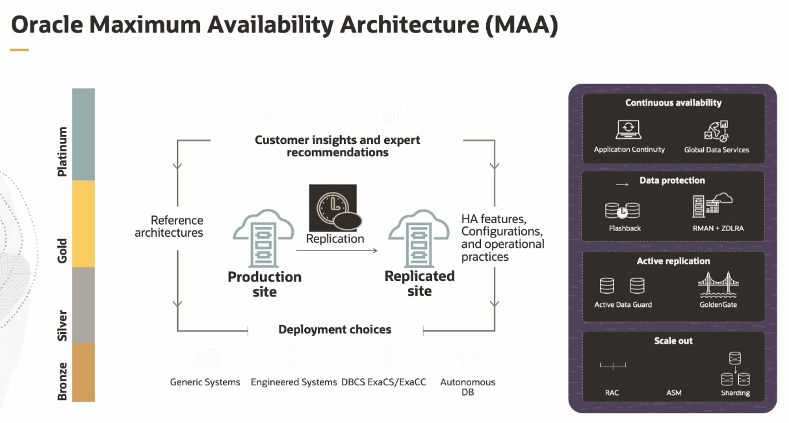
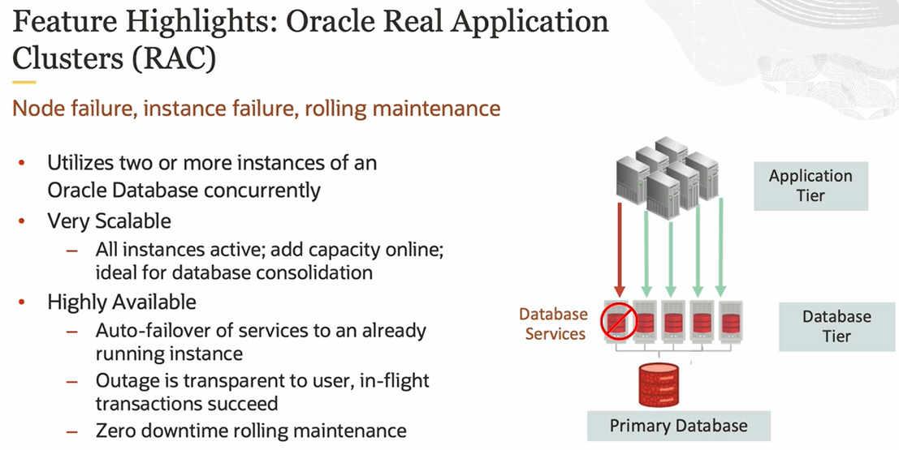
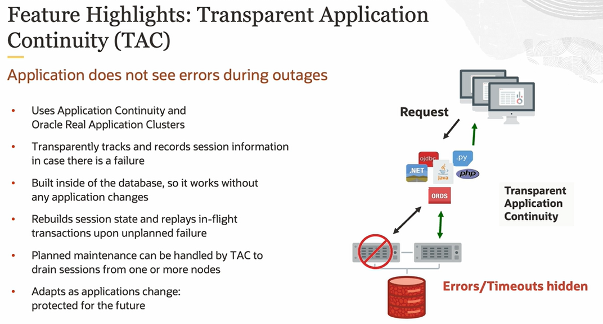
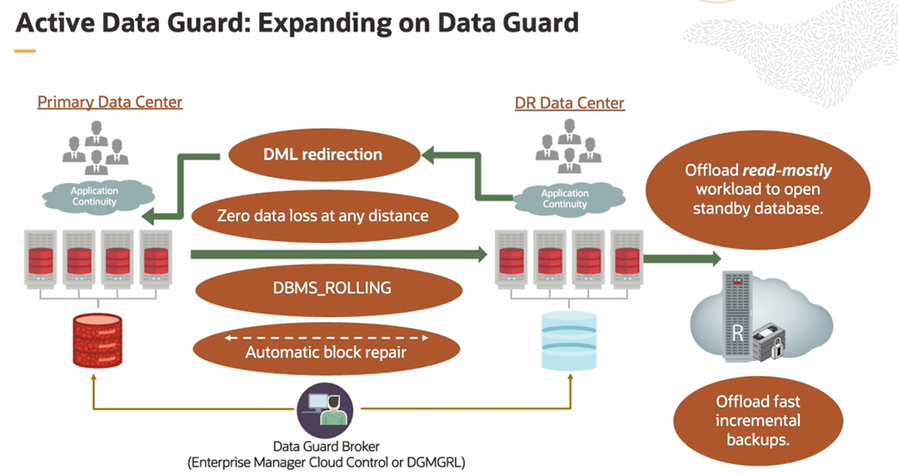
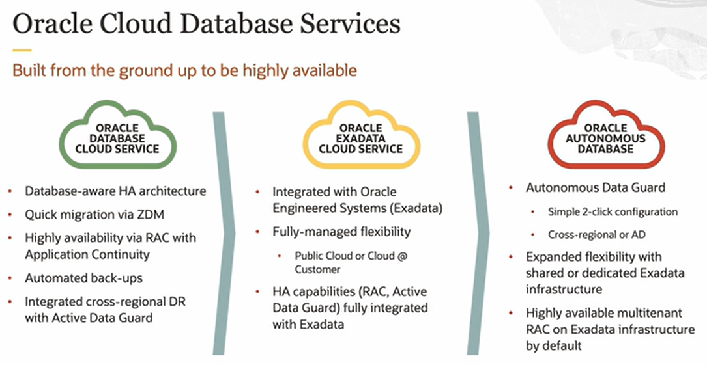

# Oracle Maximum Availability Architecture (MAA)

Oracle have different blueprints, different tiers of MAA architecture that map different RTO and RPO requirements, depending upon your needs. And those may change over time. 

The business continuity provided with MAA is for both planned maintenance and unplanned outage events.

**High availability** provides redundant components to go ahead and ensure your service is uninterrupted in case of a type of hardware failure. So if one server goes down, the other servers will be up. Ideally, you'll have a cluster to go ahead and provide that level of redundancy.

**Disaster recovery** protects us from a complete site outage. So if the site goes down entirely, we want to have a redundant site to be able to failover to. 

## Chaos Engineering

Chaos engineers take all this into consideration and build out the use cases to go ahead and test the system:

- network, server, and storage failures
- human errors 
- data corruption
- power failures or site failure
- application, database, server sofware updates
- data reorganization or changes
- application changes and optimizations

## MMA

The key goal of MAA is to achieve optimal high availability, data protection, and disaster recovery for Oracle customers at the lowest cost and complexity. 

MAA consists of reference architectures for various buckets of HA service level agreements, configuration practices, and HA lifecycle operational best practices. 

MMA reference architectures are applicable for non-engineered systems, engineered systems, non-cloud and cloud deployments.

Reference architectures:

1. Data Protection
    - Flashback
    - RMAN + ZDLRA (Zero Data Loss Recovery Appliance)
2. Active Replication
    - Active Data Guard
    - GoldenGate
3. Scale Out
    - RAC (Real Application Cluster)
    - ASM
    - Sharding
4. Continuous Availability
    - AC (Application Continuity)
    - GDS (Global Data Services)

## Real Application Cluster (RAC)

RAC is clustering technology to spread your different nodes across your different servers, so you don't have a single point of failure. From a scalability standpoint and performance standpoint, you get a lot of benefit associated with that. You constantly add a new node whenever you want to without experiencing any downtime.

## Transparent Application Continuity (TAC)

TAC is a feature of RAC to go ahead and protect **in-flight transactions**. So our application doesn't experience those transactions failing and coming back up to the layer, or even up to the end users.

All you have to do is use the correct driver and have the connection string appropriately configured. And everything else is happening in the database.

## Active Data Guard

Active Data Guard is the Oracle solution for disaster recovery. It eliminates single point of failure by providing one or more synchronized physical replicas of the production database. It uses Oracle Aware Replication to efficiently use network bandwidth and provide unique levels of data protection. It provides data availability with fast, manual or automatic, failover to the standby should a primary fail and fast switch over to a standby for the purpose of minimizing planned downtime as well. And an Active Data Guard standby is open, read only, while it is being synchronized, providing advanced features for data protection, availability, and protection offload that we will discuss in just a moment. 

## Oracle Cloud Database Services

