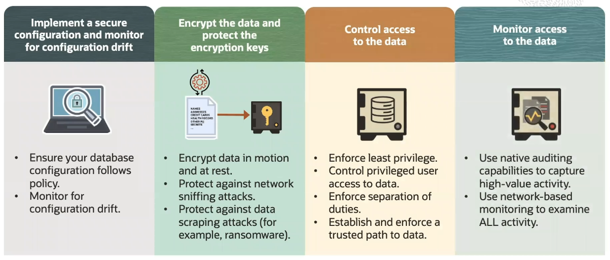
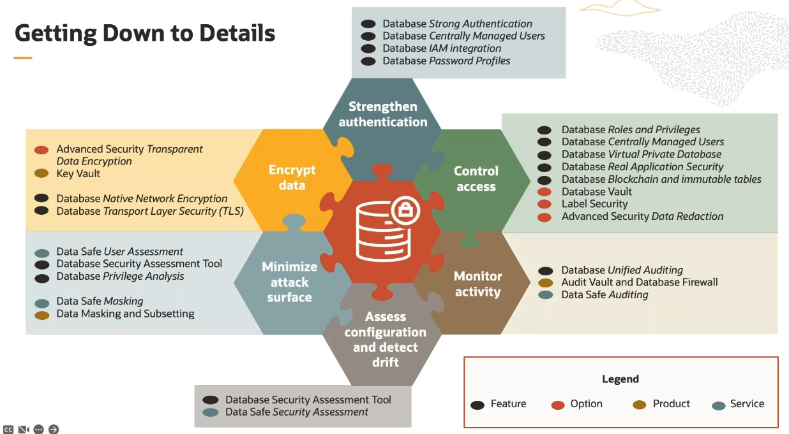
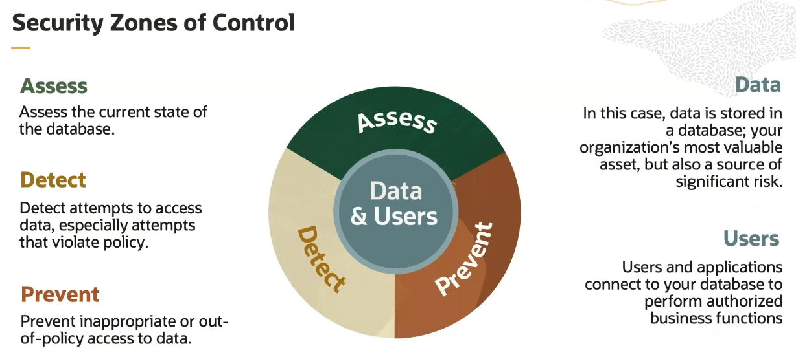
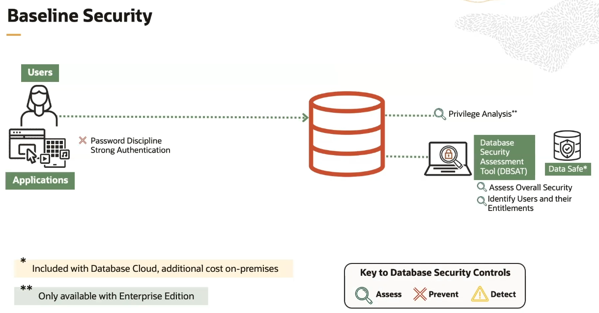

# Database Maximum Security Architecture

Securing the Oracle database is much like securing any IT system:
- implementing a secure configuration and monitoring that configuration for drift
- encrypt your data and protect the encryption keys 
- control access to your data
- monitor access to data

## Securing Oracle Database

No single product or option fully secures your database. It takes a combination of several technologies working together:
- asses configuration and detect drift
- minimize attack surface
- encrypt data *at rest* and *in motion*
- strengthen authentication
- control access and enforce separation of duties
- monitor activity

## Security Zones of Control

Securing an Oracle database is much like securing any other system.

Three things are needed:
- **assess** the current state of the database
- **detect** attempts to access data (especially attemps that violate policy)
- **prevent** inappropriate or out-of-policy access to data

## Baseline Security

There are some things we can always expect to be done, what we call the **Baseline Security Posture**. Establishing the baseline security posture involves several different types of controls. We'll assess the system state, prevent unauthorized activity, and detect activity that is relevant to our security controls.

### 1. Assess the database

Our first control is assessing the database configuration. We want to ensure we haven't made configuration decisions that introduce unnecessary risks into the environment. We'll also check to make sure that the database is current on security patches. 

**DBSAT** is a free utility available for download via my Oracle Support. **Data Safe** is a cloud service that is included at no additional cost with Oracle Cloud database services. Data Safe is also available for on-premise databases. But there is an additional cost for those.

### 2. Password Discipline

Users and applications connect to the database. We want to ensure that if they are connecting with username and password, we are practicing good password discipline. We also want to consider the use of strong authentication. Your Oracle database supports Kerberos, PKI certificate, and multifactor authentication. 

We'll want to make sure that those users really should be able to connect to the database, identifying dormant accounts, and checking to be sure we haven't granted privileges that don't make sense in our environment. Here again, DBSAT and Data Safe help by pointing out use of things like the Select Any Table privilege or grants of the DBA role. 

### 3. Privilege Analysis

We should also check that database accounts are actually using the privileges we granted. Privilege analysis monitors privilege usage and can report on privileges that an account has that are not being used. We can then remove those unnecessary privileges, reducing the attack surface presented by those users. 

