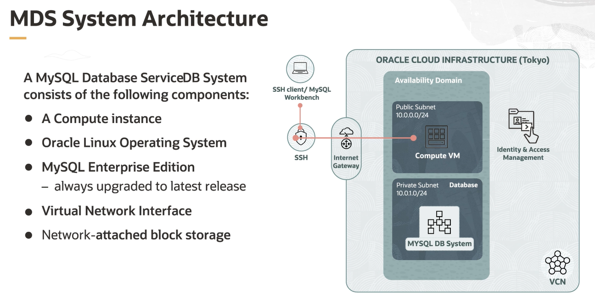

# MySQL Data Service (MDS) Architecture

A MySQL Database Service DB system consists of the following components:
- a computer instance
- an Oracle Linux operating system
- the latest version of MySQL Enterprise Edition
- a virtual network interface card (NIC)
- network attached higher performance block storage

This VCN is divided into two subnets: a public and a private subnet. The Oracle Linux computer is on the public subnet, and the MySQL Database Service instance is on the private subnet. The user accesses the MySQL Database Service with SSH and the Linux computer. 

## MDS DB System Build

After successfully logging into your Oracle Cloud Infrastructure tenancy with the OCI Console, you can start provisioning your MDS DB system. 

You will need to perform the following three major tasks:
- access your DB system basics
- create your MySQL DB instance
- create your compute instance

## MDS Connect and Run

To connect the new OCI MySQL database, you need to perform the following steps:
- set up your VCN MySQL port 3306 access
- connect to MDS using **MySQL Client** or using **MySQL Workbench**
- load the data into the MySQL database

Things to remember:
- need to craete a VCN
- first SSH into compute
- need to connect to MySQL Database Service:
    - a compute instance
    - username and public IP
    - DB username and password
- do not use reserved words for DB username