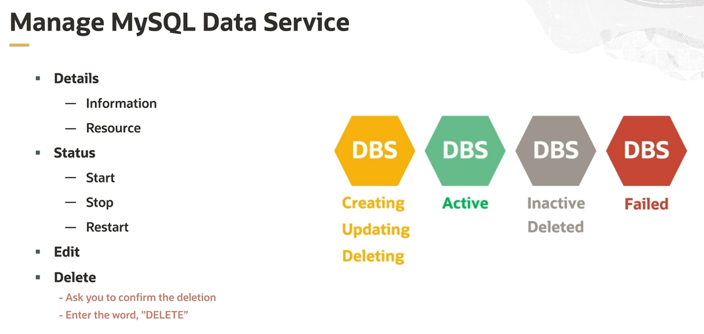
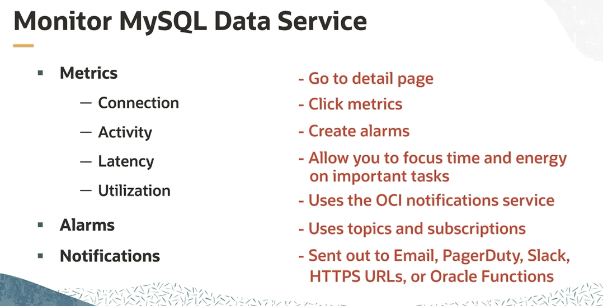

# MySQL Data Service (MDS) Operations

**NOTE.** Stopping a DB system stops billing for all OCPUs associated with it. Billing continues for storage, and billing for OCPUs resumes if you restart the DB system.

