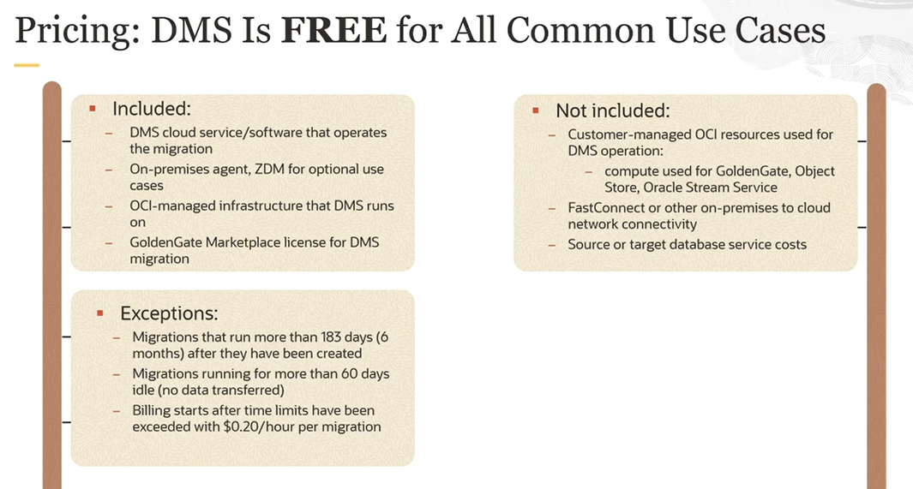

# Migration

When selecting a migration method for moving your database to the Cloud, take into consideration:

1. the database version
2. the database size
3. high availability

Migration Types:
- Offline Migration
    - a **one-time snapshot** of your source database
    - anything that comes after the snapshot is not going to be moved
    - you have to basically stop using the database in taking it offline
    - this causes **downtime**, which is not acceptable in a lot of cases
- Online Migration
    - a **one-time snapshot** of your source database
    - at the same time you're also starting **replications**

## OCI Database Migration Use Cases

## Oracle Solutions to Migrate Database to Oracle Cloud

For OCI Data Migration, DMS, our focus is ease of use. We're based on zero downtime migration. 

In Zero Downtime Migration (ZDM) you get more fine-grained control. You have more options that you can choose from. ZDM does support non-autonomous targets and also migration to ExaCC. So you can still install ZDM on-premises and do basically an on-premises to ExaCC migration. This is not possible with OCI Database Migration, DMS.

The other tools have their own capabilities as well, and you can think of basically the three levels where you have EMS being the most abstract one, which is based on ZDM, and ZDM itself is based on the database tools.

## Tools for all steps of the Migration Process

1. **Decision**: Migration Advisor
2. **Planning**: Cloud Premigration Advisor Tool (CPAT)
3. **Database Migration**: OCI Database Migration
4. **Application Migration**: OCI Application Migration
5. **Validation**: GoldenGate Veridata

## DMS Pricing

DMS is free for all common use cases. And what's included in the pricing is the service itself, all the environment that the service runs on, and the infrastructure that the service runs on.

We also have a GoldenGate Marketplace license that is specific for migration that's free for six months. So you can use that and you're not charged the licensing fee for GoldenGate, but you have to pay for all the resources that run in your tenancy and there are dependencies. This is the compute that GoldenGate Marketplace runs on, the Object Store Bucket, and, if you're using an agent, the streaming service.

Also, all the networking if you're setting up FastConnect VPN. Anything else that's not free, you have to pay for that separately. And obviously, the source and target databases.

