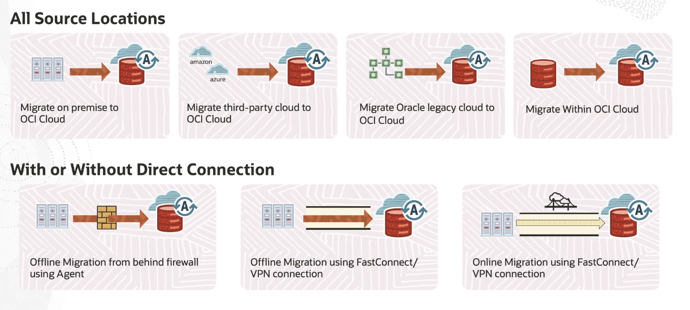
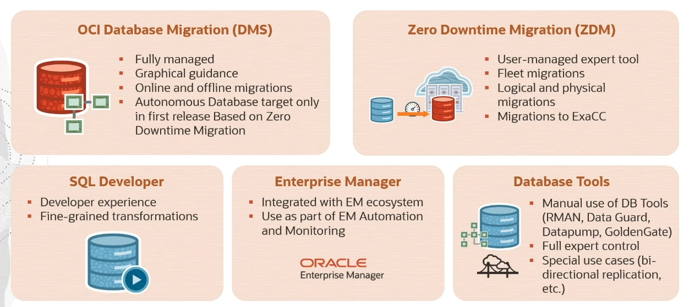

# Migration

When selecting a migration method for moving your database to the Cloud, take into consideration:

1. the database version
2. the database size
3. high availability

Migration Types:
- Offline Migration
    - a **one-time snapshot** of your source database
    - anything that comes after the snapshot is not going to be moved
    - you have to basically stop using the database in taking it offline
    - this causes **downtime**, which is not acceptable in a lot of cases
- Online Migration
    - a **one-time snapshot** of your source database
    - at the same time you're also starting **replications**

## OCI Database Migration Use Cases

## Oracle Solutions to Migrate Database to Oracle Cloud

