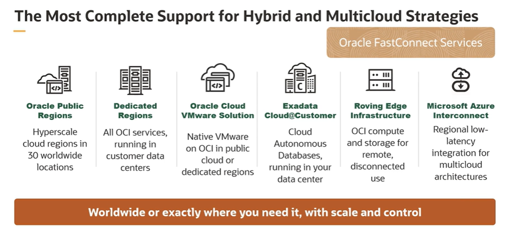
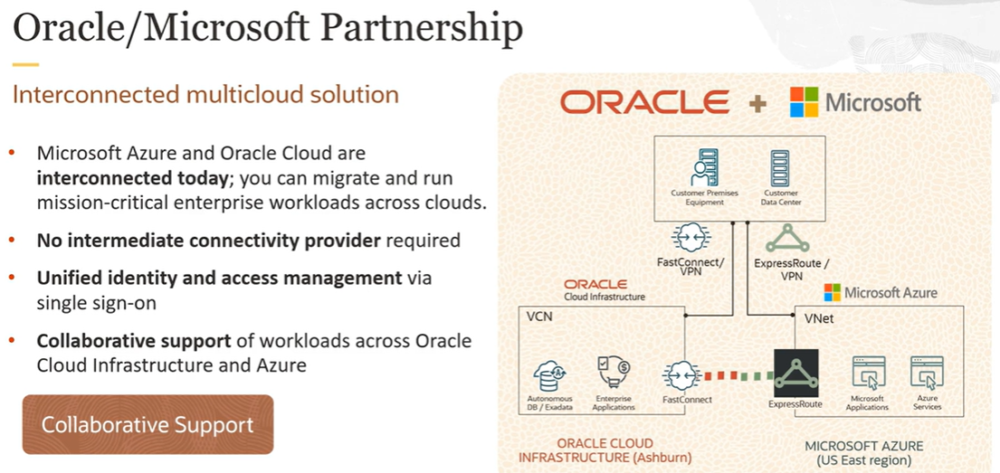

# Multicloud Strategy

Multicloud is the use of multiple cloud computing and storage services in a single heterogeneous architecture.  The multicloud environment aims to eliminate the reliance on any single cloud strategy provider.

A multicloud strategy:
- provides more flexibility for which cloud services to use. 
- reduces dependence on a single cloud hosting provider

Benefits of multicloud strategy:
- best-of-breed innovation
- reduced risk and increased redundancy
- reduced latency
- compliance and governance
- multicloud economics
- reduced vendor lock-in

## Oracle/Microsoft Partnership

Azure and Oracle Cloud are interconnected today.

