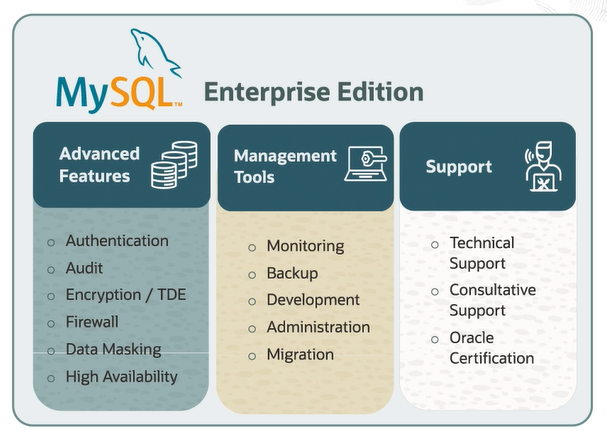
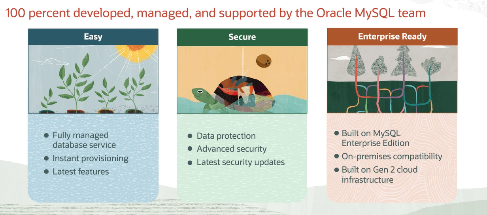
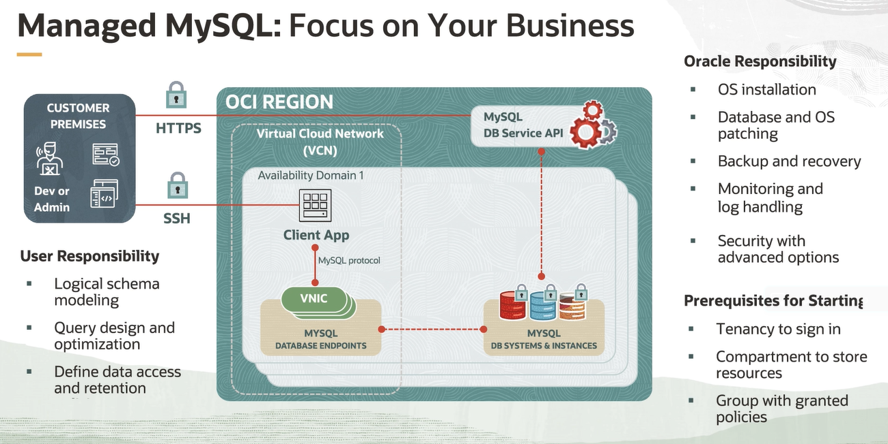

# MySQL Data Service

MySQL is the number one open-source database and the second most popular database overall, after the Oracle Database. MySQL also received the DBMS of the Year Award from DBEngines.com.

MySQL comes in two flavors:
- free version (MySQL Community Edition)
- paid version (MySQL Enterprise Edition)

## MySQL Community Edition

MySQL Community, the free version, contains the basic components for handling data storage. Just download it, install it, and you're ready to go. 

But *free* has costs:
- data is not  secure
- data recovery is not easy
- no support

## MySQL Enterprise Edition

MySQL Enterprise Edition was created to provide:
- high availability
- security
- support

MySQL on Third-Party Clouds:
- expensive
- dot not include advance features and tools
- not supported by the Oracle MySQL experts

## MySQL Datatabase Service (MDS)

MySQL Database Service in Oracle Cloud Infrastructure is the only MySQL Database Service built on MySQL Enterprise Edition and 100% built, managed, and supported by the MySQL team.

MySQL oOracle Cloud Infrastructure:
- easy to use
    - fully managed
    - latest feature (e.g. MySQL Document Store)
- security first
    - data is encrypted for privay
    - data stored in OCI Block Volumes
    - OCI Gen2 provide maximum isolation and protection
    - reduces risk of data breaches
    - regulatory compliance
- enterprise ready
    - 24x7 support from the MySQL Team
    - no additional cost
    - more features (scalabilty, data-at-rest encryption, native backup, etc.)

Things to remember:
- MDS is fully managed
- MDS stores data on OCI Block Volumes
- MDS uses advanced security for regulatory compliance
- integrated with Oracle Technologies
- user must have OCI tenancy, a compartment, and belong to a group with required policies

