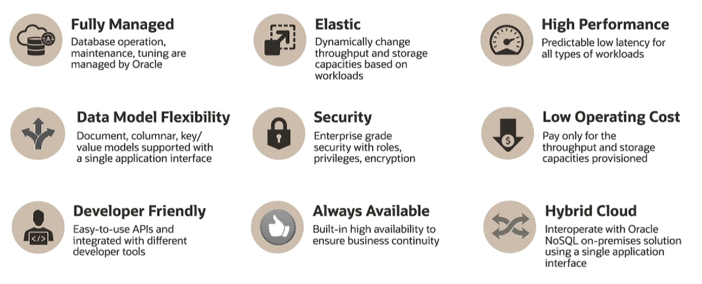
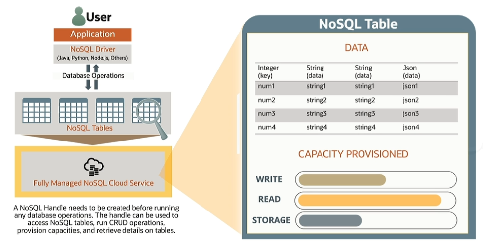

# Oracle NoSQL Database Cloud Service

The Oracle NoSQL Database Cloud Service really offers a lot of great properties. 

Oracle NoSQL Database Cloud Service is **developer friendly**:
- ready to deploy your application data store in minutes
- drivers available in multiple programming languages
- Standards open APIs and SQL query language
- simple and complex data types
- developer tools
- service console UI for a quick review

## Pricing Model

1. Pay per table capacity provisioned
2. Pay per throughput and storage capacity provisioned

# NoSQL Table Anatomy

1. Data component
2. Capacity provisioned

## Service Interface

There are several different ways that you can experience the Oracle NoSQL Database Cloud Service.

1. Service UI Console
2. SDKs
3. NoSQL Cloud Simulator