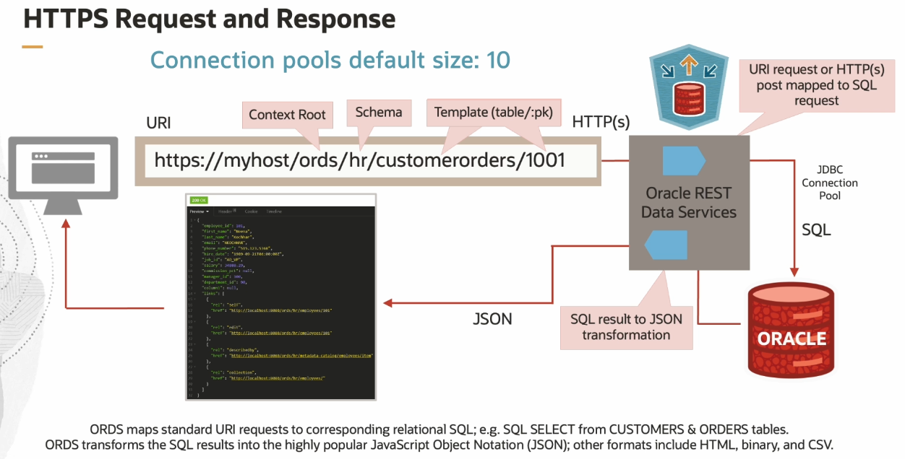
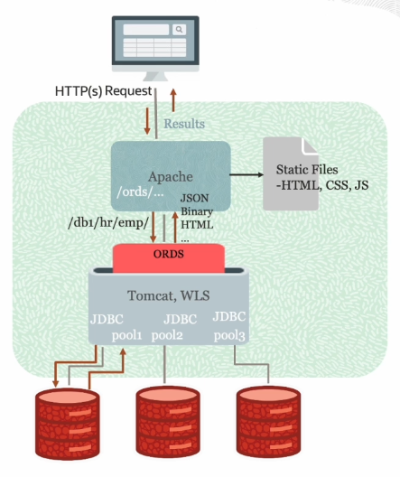
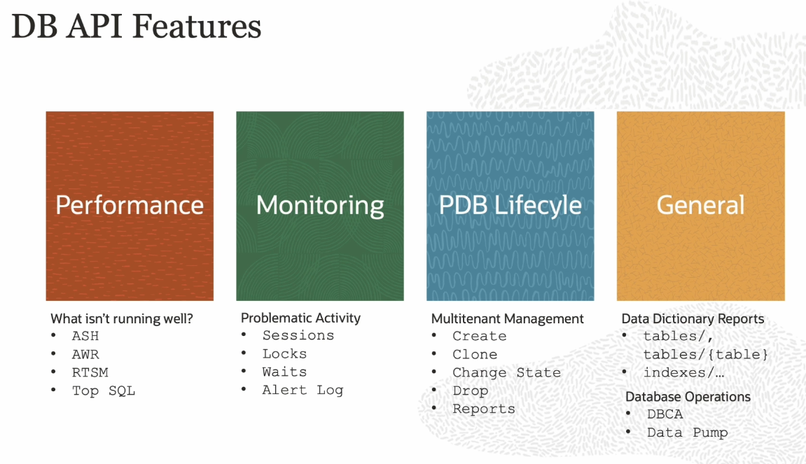

# REST Apis

Oracle is not just a relational database anymore and the REST APIs can be deployed with **Oracle REST Data Services (ORDS)**.

You can use ORDS for application development and accessing the data and can be used as a powerful tool for automating management, lifecycle, provisioning, and data-dictionary-type use. 

Oracle Cloud offers full REST APIs for DBAs and developers who would prefer to interact with Oracle Autonomous Database Cloud Services programmatically over REST rather than log into the Cloud Console and click through screens. This provides a mechanism for developing customized deployment and management scripts that can be saved and reused for deployments, setting gold standards, and storing entire application infrastructure stacks as version-controlled code.

The Oracle Cloud Infrastructure APIs are typical REST APIs that use HTTPS requests and responses and support HTTPS and SSL protocol TLS 1.2, the most secure industry standards. 

The way that you interact with your data are the API calls via HTTP:
- GET to access your data and stored procedures
- PUT to update your data
- POST to insert your data and execute PL/SQL
- DELETE to remove your data

## Oracle REST Data Service (ORDS)

ORDS runs in a Java servlet or it can be run within Tomcat or WebLogic Server (WLS) for E-Business or Fusion. The request comes into the web server and ORDS handles the request. ORDS is included in your Oracle Database license. Normally there is a load balancer in front of the Apache server to handle the requests coming in. 

To get started using ORDS:
1. install ORDS (run the installer)
2. enable the DP API
3. REST-enable an Oracle User
4. Browse the DB API Service Documentation

What goes into the database is the schema **ORDS_METADATA** and the user **ORDS_PUBLIC_USER**.

## DB API Features

There are over 600 REST endpoints provided to manage and monitor your Oracle Database. These are supported starting from 11gR2 up to the current version of the database. The REST APIs have general information, data dictionary, monitoring, performance, and lifecycle management. 

A privileged user should be created for the Database APIs:
- option 1: Mid-Tier User (SQL Administrator Role)
- option 2: REST-Enabled DB User
This is either for web server or a database user with the permissions on a schema when you enable that schema for REST. It allows for REST authentication.

