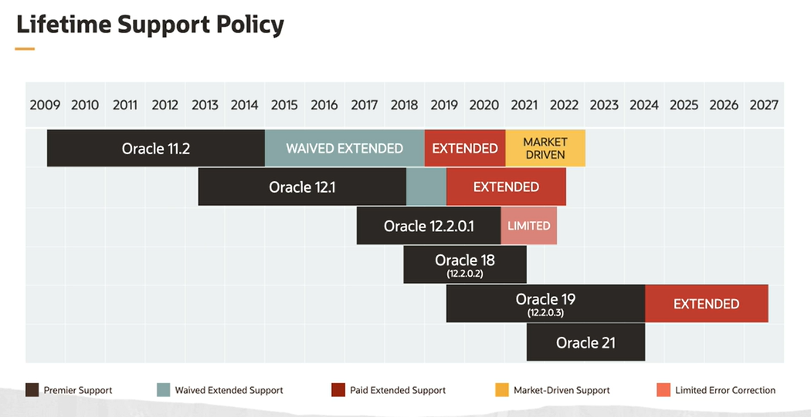
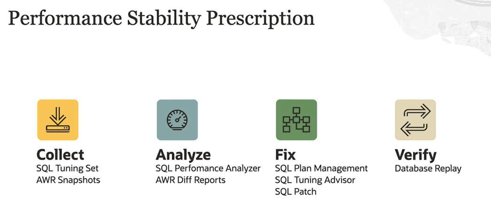
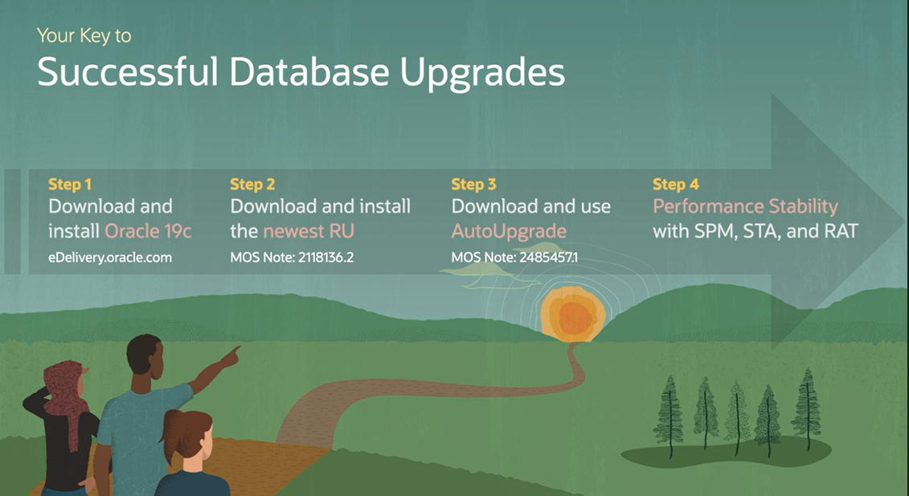

# Upgrade

The target release that we recommend you go to for any Oracle database upgrade is the 19c. Why? Because 19c is currently the only long term support release we have in Oracle.

A Long Term Support (LTS) release means:
- five years of premier support 
- two years of extended support (at least two years)

Oracle 19c is the final release supporting non-CDB architecture. In 19c you can have up to three user pdbs without requiring any extra license.

## SQL Plan Management

One feature that we recommend you to use to be prepared is SQL Plan Management. With SQL Plan Management, you can get all of the SQL queries you have in your system before upgrading and forcing a plan to run on those SQLs. So after you get your system upgraded, you won't have any plan regression because all the SQLs will have the same plan as before. So SQL Plan Management is a way to force an SQL plan so you don't have any regression, any unexpected behavior in the upgraded system. 

## Performance Stability Prescription

Oracle also offers you some performance stability prescription.

## AutoUpgrade

You should always use **AutoUpgrade** to operate your database. We have put so much new functionality into AutoUpgrade that you're really missing out if you use any of the alternate methods. You can use AutoUpgrade to upgrade a single database or multiple databases in just one command, which really enables you to do end-to-end automation with AutoUpgrade.

You should always get the latest version of AutoUpgrade from My Oracle Support.

AutoUpgrade is fully backwards compatible.

## Fallback

Flashback Database should be your primary fallback option. Flashback Database is reliable and super fast. It's the best way and the fastest way to flashback or to fall back a database upgrade. 

When you're using the AutoUpgrade, you don't have to worry, it's built into the tool. AutoUpgrade will automatically set a guaranteed restore point and you can flashback the database with AutoUpgrade as well. 

If you're on Standard Edition you have to use another method because you're not allowed to use Flashback Database. In that case, I would recommend that you look into partial offline backup. 

Something to be aware of with Flashback Database, you cannot use it after go-live. Once users have been allowed to connect to the database and enter new data into the database, you cannot do a Flashback Database because that would mean data loss. If you need to fall back after go-live, you have two options. Either use Data Pump or a database downgrade. Either method you choose, be sure to test it before you do the production upgrade. 

## Compatible Parameter

You should raise the compatible parameter 7 to 10 days after upgrade. This will give you enough time to see whether there are some critical issues that could cause you to start a database downgrade, because as soon as you change the compatible parameter you can no longer do Flashback Database or do a database downgrade. 

When you change the compatible, you should always set it to the default of the release that you're upgrading to. When you're going to Oracle database 19c, the value should be 19. 

**NOTE.** Raise the compatible parameter when you are sure that you don't want to fall back. 

**NOTE**. If you cannot take the additional downtime it requires to change the compatible parameter after the upgrade in the following weekend, for instance, you have to change compatible immediately after the upgrade.

**NOTE**. Be sure to only change the compatible parameter when you're upgrading. You don't have to change it when you're just patching.

## Post Upgrade

1. **Statistics**: collect them as few as possibile
2. **Parameters Change**: run at Default Configuration as much as possibile, follow the MOS recommendations

## Steps to Database Upgrade

